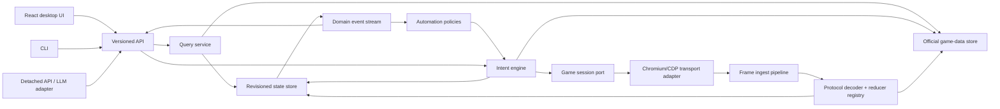

# CitadelOps Architecture

This document describes the application boundaries shared by two explicit
compositions of the same binary. CitadelOpsDesktop remains the default N=1
composition with one local profile, game session, and dashboard. Opt-in hosted
mode owns one bounded process supervisor and can reconcile N independent
Background account runtimes live. The hosted web application and backend
control plane remain separate products; they connect through the worker's
private orchestration and runtime-shard contracts.

## Goals

- Keep the existing React visual design and user workflows.
- Replace the server implementation and frontend transport contract.
- Treat official Goodgame Empire data as versioned runtime input, not source
  code or manually maintained lists.
- Build one canonical normalized account view from private state plus
  allowlisted same-world facts observed in incoming game frames.
- Route every mutation through one deterministic intent planner and executor.
- Let the desktop UI, automations, CLI, detached API, and future LLM tools use
  the same read and command surfaces.
- Make unknown protocol fields and new official-data collections observable
  without requiring an application release.
- Remove compatibility methods after their frontend consumers are migrated.

## Non-goals

- Reproducing old package boundaries or exported functions.
- Keeping checked-in copies of the complete official item database.
- Letting UI or automation code assemble raw game websocket payloads.
- Encoding display names, game IDs, costs, levels, effects, or catalog choices
  in feature code when the official data contains them.
- Making the game transport, browser automation, parser, or frontend API aware
  of each other's concrete implementations.

## Legacy architecture extracted from 1.3.8

The reference server contains roughly 64,000 lines of Go. Its responsibilities
are valid, but their ownership is not isolated:

1. The root process embeds the built React application and starts HTTP, the
   frontend websocket, browser automation, snapshots, reporting, tracking, and
   update checks.
2. `ResponseRegistry` launches Google Chrome through CDP, identifies the live game
   websocket, captures frames, injects JavaScript to send frames, tracks login
   state, owns response waiters, retries login cooldowns, and starts command
   lanes.
3. `GameParser` splits `%xt%...%` frames, routes opcodes, mutates global models,
   resolves official-data metadata, wakes waiters, and calls frontend callback
   globals. The current router directly handles more than forty opcode groups.
4. `Models` holds a process-wide mutable `GameState`, persistence behavior, UI
   DTO shapes, catalog-derived values, settings, reports, and feature-specific
   state.
5. `GameCommands`, `Automation`, and `Toolkit` collectively build payloads,
   coordinate feature claims, queue lanes, trace commands, expose primitive
   commands, and assemble context-dependent operations.
6. `GameFeatures` combines policy, scheduling, parsing assumptions, state
   reads, command creation, persistence, and UI notifications.
7. `FrontendWebsocket` accepts about eighty unversioned message variants in one
   switch and broadcasts feature-specific, untyped payloads. React consumers
   inspect `message.type` independently and frequently use `any`.
8. Official item data is fetched by a development command, split into many
   catalog files, embedded or read from `Server/Data`, copied again under
   `Client/public/game-data`, and wrapped by several feature-specific indexes.
9. Reports, tracker history, snapshots, presets, schedules, and feature
   settings use independent JSON files under the instance data directory.

The central failure mode is dependency direction. Feature code can reach into
the parser, global model, browser connection, command queue, and frontend hub.
Parser code can reach into commands, scheduling, persistence, and callbacks.
Consequently, a wire-field or model change spreads across unrelated packages.

## 2.0 system boundary



Only the composition root knows concrete implementations. Package-level
mutable singletons and callback assignment are not allowed.

## Package responsibilities

### `Server/GameData`

Owns official static definitions and language data.

- Resolve `ItemsVersion.properties` to a concrete versioned item URL.
- Download to a per-instance cache with timeouts, size limits, validation, and
  atomic replacement.
- Load the complete official JSON document once and preserve every collection
  as `json.RawMessage`.
- Discover collection schemas and primary keys, with small explicit overrides
  only for ambiguous official schemas.
- Build indexes lazily and expose typed projections for domains used by the
  application: units, buildings, construction items, packages, resources,
  currencies, effects, equipment, gems, rewards, recipes, VIP levels, and
  subscription buffs.
- Expose source version, language version, fetch time, and content digest.
- Serve catalog data to the frontend from the same in-memory snapshot used by
  parsers and intent planners.

The source endpoints are:

- `https://empire-html5.goodgamestudios.com/default/items/ItemsVersion.properties`
- `https://empire-html5.goodgamestudios.com/default/items/items_v{version}.json`
- `https://langserv.public.ggs-ep.com/12/fr/@metadata`
- `https://langserv.public.ggs-ep.com/12@{version}/{language}/*`

Official data is cache state, not repository state. The server and client must
not carry parallel copies.

### `Server/Protocol`

Owns the game wire grammar, not game state.

- Decode inbound and outbound `%xt%` frames without losing unknown fields.
- Preserve raw payload, namespace token, opcode, response code, direction,
  timestamp, and transport metadata.
- Encode validated command frames from structured command steps.
- Register opcode reducers without a central switch.
- Publish decoded frames to response correlation and observability streams.
- Treat an unknown opcode as a valid observation, never as a fatal error.

JSON payloads remain raw until an opcode reducer decodes the fields it owns.
Reducers do not send commands or notify the frontend.

### `Server/State`

Owns live player state, allowlisted observed-world facts, and revision ordering.

- Apply mutations serially and assign a monotonic revision.
- Store runtime facts only. Static names, levels, effects, costs, and images
  remain references into `GameData`.
- Emit domain changes after a committed mutation.
- Return immutable component generations and bounded projections for queries
  and intent planning.
- Persist dirty account components and bounded world-map partitions independently;
  the legacy complete snapshot is a migration source, not a hot write path.

The normalized aggregate contains:

- session and observed server metadata;
- player identity, alliance identity, account currencies, and progression;
- castles keyed by castle instance ID, with location, resources, buildings,
  unit stacks, production queues, crafting queues, hospital, and construction
  slots;
- commanders, castellans, equipment instances, gems, and inventory;
- movements keyed by movement ID;
- alliance members and shared reports;
- map observations keyed by kingdom and coordinate;
- automation observations and operation receipts.

Wire identifiers remain distinct types. In particular, construction-item CID,
building/decor wodID, building instance OID, castle instance AID, commander ID,
movement ID, package PID, and kingdom ID must not be interchangeable integers.

### `Server/Ingest`

Owns the ordered inbound pipeline.

1. Receive a raw transport frame.
2. Decode it through `Protocol`.
3. Record redacted telemetry.
4. Resolve the registered reducer for the opcode.
5. Decode only that reducer's payload model.
6. Resolve static references through the current `GameData` snapshot.
7. Commit one state transaction.
8. Publish the resulting domain changes.
9. Complete matching command awaits after the state commit.

This ordering guarantees that an intent waiting for a response always observes
the state produced by that response.

### `Server/Intent`

Owns every operation that may affect the game.

An intent request contains a stable request ID, intent name, actor, structured
arguments, optional expected state revision, and dry-run flag. A registered
planner reads an immutable state snapshot and game-data snapshot and returns a
plan containing:

- effect classification;
- resource claims;
- preconditions and the revision they were evaluated against;
- structured protocol steps;
- response/state await conditions;
- retry and timeout policy;
- a redacted preview.

Execution revalidates the plan, acquires claims, serializes the protocol frame,
sends through the session port, waits for committed observations, and emits one
receipt. Raw payload submission is not a normal intent and is never exposed to
remote or LLM surfaces by default.

The React UI, CLI, automation policies, and external adapters submit the same
intent model. No caller gets a private command path.

### `Server/Session`

Owns lifecycle and the abstract game connection.

- `Start`, `Stop`, `Status`, `Send`, and inbound-frame subscription form the
  port consumed by the application.
- The first adapter targets the Chromium DevTools Protocol and injected
  JavaScript because the game session and authentication live in a browser.
- Brave, Chromium, Chrome, Edge, Vivaldi, Opera, Arc, or an explicit compatible
  executable can be selected without changing the session port.
- Browser discovery, process management, websocket discovery,
  execution-context tracking, cooldown handling, and reconnect behavior remain
  inside the adapter.
- Every selected browser uses an app-owned profile under the instance data
  directory. CitadelOps never attaches to or locks the user's daily profile.
- Selection is persisted and exposed as an intent, so the React UI, CLI, and
  detached API clients all use the same configuration path.
- The adapter does not parse domain payloads, mutate state, queue feature work,
  or broadcast frontend messages.
- A replay adapter can feed captures into the same ingest pipeline.
- A future direct websocket adapter can replace the browser without changing state,
  intents, automations, or API code.

### `Server/Automation`

Owns policies, not transport mechanics.

- Each feature observes state and time, decides whether work is needed, and
  submits an intent.
- Schedules, enablement, and user preferences are configuration.
- Claims, priority, cancellation, command serialization, and receipts belong
  to the intent engine.
- An automation may not mutate state optimistically or call a payload builder.

### `Server/Scheduling`

Owns delayed execution without creating a second command path.

- Persist the named intent, canonical arguments, actor, and execution time in
  revisioned state.
- Re-submit due work through `Intent`, where current state, official data,
  claims, and preconditions are re-evaluated immediately before sending.
- Record scheduled, running, succeeded, failed, and cancelled status for every
  delayed operation.
- Never persist a serialized websocket frame or bypass intent receipts.

### `Server/API`

Owns versioned DTOs and transport only.

Initial HTTP surface:

- `GET /api/v2/health`
- `GET /api/v2/state`
- `GET /api/v2/game-data`
- `GET /api/v2/game-data/{collection}`
- `GET /api/v2/intents`
- `POST /api/v2/intents/{name}`
- `GET /api/v2/operations/{id}`
- `GET /api/v2/events` (websocket upgrade)

The websocket envelope contains `v`, `id`, `type`, `revision`, and `payload`.
The small event vocabulary is `session.status`, `state.snapshot`,
`state.changed`, `catalog.changed`, `operation.changed`, and `notification`.
Feature names belong inside typed payloads, not in new top-level message types.

The API never serializes internal maps or domain structs accidentally. DTOs are
explicit and independently versioned.

### `Server/App`

Owns construction, lifecycle, and dependency injection.

- Resolve paths and configuration.
- Load or update official data.
- Construct state, reducers, intent definitions, session adapter, automation
  policies, API, telemetry, and persistence.
- Start and stop components through one context.
- Contain no protocol, feature, or HTTP handler logic.

## Frontend rewrite boundary

The component tree, CSS, icons, navigation, and interaction design stay in
place. The communication and data layers change:

- Replace `Client/src/Websocket.ts` and distributed `message.type` checks with
  one typed API client, event store, and selectors.
- Replace feature-specific initial websocket requests with one state snapshot,
  one catalog manifest, and event subscription.
- Submit mutations as named intents with request IDs and render operation
  receipts/progress consistently. Submission is asynchronous: the runtime
  accepts the operation (`202` with the accepted receipt), executes it under
  its own lifetime, and streams `operation.changed` until completion, so a
  closed or disconnected dashboard never cancels an operation. `?wait=true`
  keeps a synchronous response for callers that want the final receipt.
- Resolve names, images, costs, levels, and picker options from the backend
  catalog service.
- Remove `Client/public/game-data` after all consumers use the catalog client.
- Keep view-local form models only; do not mirror the entire backend state in
  unrelated React contexts.

## Persistence

All mutable files live below the instance data directory. They are grouped by
purpose and carry a schema version:

```text
DataDir/
  GameData/       official immutable cache and metadata
  State/          recoverable live-state snapshot
  Config/         user settings, schedules, and presets
  History/        reports and player tracking
  Telemetry/      bounded logs and command receipts
```

Writers use temporary files plus atomic rename. Migrations are registered by
schema version; feature code does not search legacy executable directories.

## Legacy-to-2.0 crosswalk

| Legacy responsibility | 2.0 owner |
| --- | --- |
| `ResponseRegistry` browser/CDP code | `Session` Chromium/CDP adapter |
| `ResponseRegistry` waiters | `Intent` await registry fed after state commit |
| `GameParser` switch and callbacks | `Protocol` registry + `Ingest` |
| `Models.GetGameState()` globals | injected `State.Store` |
| UI-shaped server models | `API` DTO projections |
| `GameCommands` payload functions | registered `Intent` planners |
| `Automation` broker/coordinator | `Intent` executor and claims |
| `Toolkit` command/context tools | API/CLI adapters over `Intent` and queries |
| `GameFeatures` loops | `Automation` policies |
| `FrontendWebsocket` message switch | versioned `API` handlers/events |
| `OfficialData` build command and embedded files | runtime `GameData` updater/cache |
| `Client/public/game-data` | backend catalog endpoints |
| model-owned JSON persistence | shared versioned persistence service |

## Delivery order

1. Foundation: official-data cache/store, protocol frame codec, revisioned state
   store, intent registry/executor, session port, and v2 API.
2. Connection slice: browser-neutral Chromium adapter, browser discovery and
   selection, session status, raw frame ingest, replay
   transport, and frontend connection controls.
3. Castle slice: login/initial-detail/JAA reducers, normalized castles,
   resources, troops, buildings, construction slots, focus intents, and the
   existing castle dashboard.
4. Movement slice: movements, commanders, map observations, spy/attack plans,
   and movement UI.
5. Equipment slice: inventory, effects from official data, loadout intents,
   optimizer, and equipment UI.
6. Production slice: barracks, tools, hospital, crafting, TCI, transports, and
   their automation policies.
7. Reports and alliance slice: battle reports, spy reports, alliance state,
   targets, and player history.
8. Secondary surfaces: CLI, detached API mode, and constrained LLM adapter.
9. Remove the last client static catalogs and any temporary migration adapters.

Each slice is complete only when incoming frames update canonical state, all
outbound actions use an intent, the API exposes explicit DTOs, and the existing
view consumes the v2 contract.

## 2.0 completion checks

- No legacy server package remains in the 2.0 tree.
- No complete official catalog is checked into `Server` or duplicated in the
  client.
- No feature owns a raw websocket send path.
- No parser invokes a command, scheduler, browser, or frontend callback.
- No frontend component switches directly over an untyped global message.
- Every state change has a monotonic revision and declared changed domains.
- Every outbound operation has a plan and receipt with redacted telemetry.
- Replay and live transports produce the same state transitions.
- UI, CLI, API, automation, and LLM adapters share query and intent contracts.
