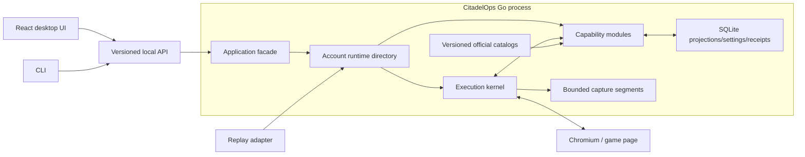
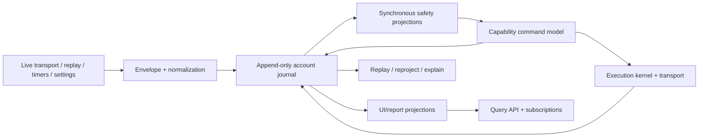
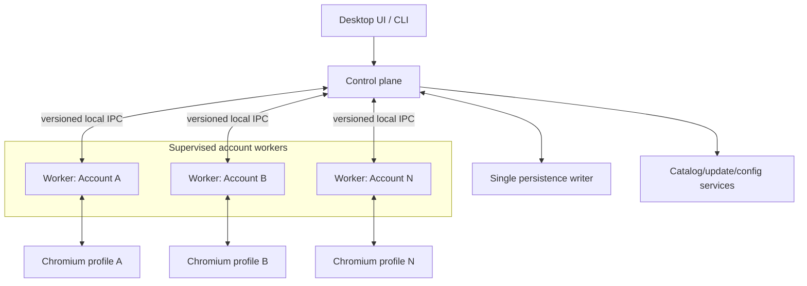

# Three greenfield architecture options

## How to read these options

All three options implement the same [account capability runtime](TargetAbstraction.md) and the same behavior-preservation contract. They differ in topology, persistence authority, consistency boundaries, and operational burden.

They are intentionally described as complete solution packages:

- Option A optimizes for parity, desktop simplicity, and maintainability.
- Option B optimizes for replay, explainability, protocol research, and derived analytics.
- Option C optimizes for multi-account fault isolation and remote/headless execution.

The recommended design combines Option A with a bounded journal borrowed from Option B. Option C remains a contract-compatible escalation path.

## Option A: capability-oriented modular monolith

### Summary

Ship one Go application process containing the account runtime, execution kernel, capability modules, persistence adapters, API, and desktop lifecycle. Chromium remains a separate operating-system process, as it is today. The React UI and CLI call versioned application contracts.

This applies [hexagonal architecture](https://alistair.cockburn.us/hexagonal-architecture) at the product boundary and information hiding inside the core. “Monolith” describes deployment, not poor modularity.

### Topology

### Core implementation decisions

1. **One ordered loop per account.** A profile-scoped bootstrap loop becomes account-bound after the authoritative login baseline. All observations that can affect that account then enter one sequencer. Reducers update only their owning capability stores. Multiple accounts can have independent loops inside the process.
2. **Typed capability modules.** Construction, equipment, movement, alliance, events, and other domains expose small registration descriptors to the composition root; they do not import infrastructure implementations.
3. **Direct in-process calls.** Use interfaces and typed calls rather than an all-purpose message broker. This keeps sequencing, failure, and transactions visible.
4. **One application-owned database writer.** Capability stores participate in short transactions through a unit-of-work boundary. Snapshots and receipt changes can be committed consistently where required.
5. **Selective observation journal.** Persist only diagnostic/replay records and operation causality chosen by retention policy. It is not the write model for every field.
6. **Versioned public contracts.** HTTP and event-stream adapters translate capability DTOs; an API v2 compatibility adapter protects existing callers during migration.
7. **Compile-time extension first.** New first-party capabilities are normal Go packages registered in the composition root.

### Consistency model

- Observation order is strong within an account/session.
- Capability mutation is synchronous in the account loop.
- A command plan reads explicitly versioned capability snapshots.
- Required responses are reduced before the receipt succeeds.
- UI snapshots/deltas are causally ordered per projection; a gap causes a targeted refetch.
- Reports and non-safety analytics can be eventually updated outside the account loop.

This model most closely matches current behavior and therefore has the lowest parity risk.

### Failure model

- A capability error fails its current reduction or operation and is recorded with the source observation. Panic containment at the account-loop boundary can mark the runtime unhealthy, but memory corruption or a process-wide resource failure can still affect all accounts.
- A database failure pauses effects that require durable receipts/settings rather than continuing untracked.
- A full inbound queue should stop/reconnect and request authoritative refresh instead of silently dropping state-changing messages.
- A Chromium crash changes the session generation, cancels unsafe waits, and starts the existing recovery policy.

### Strengths

- Lowest behavioral-fidelity risk: most safety-critical work remains synchronous and in process.
- Simplest installation, upgrade, support bundle, and local debugging story.
- Good performance with no IPC serialization between reducer, planner, and execution kernel.
- Capability boundaries can be enforced through Go `internal` packages and import checks.
- UI, CLI, replay, tests, and headless mode share the same application ports.
- Easy to deliver incrementally as vertical capability slices.

### Costs and risks

- One process is a shared failure and memory domain.
- A noisy account needs explicit queue, CPU, and storage quotas.
- Boundary discipline can erode unless import rules and public-package budgets are automated.
- Third-party code cannot safely run in process.
- Remote access is possible through an adapter but needs a separate security/operations design.

### Choose Option A when

- the primary product remains a local desktop application;
- one or a small number of accounts is the normal workload;
- exact behavioral parity and rapid feature work matter more than physical isolation;
- the team wants one deployable and straightforward diagnostics;
- replay and analytics are valuable but not the sole product identity.

### Do not choose it unchanged when

- a worker crash must never affect other concurrently controlled accounts;
- dozens of live account sessions per host are a committed workload;
- untrusted third-party extensions are required;
- the product is becoming a remotely operated service with independent worker upgrades.

Those are triggers to extract the already-defined account runtime, not reasons to begin with distributed services.

## Option B: journal-first capability core with CQRS projections

### Summary

Make a durable, ordered journal of selected observations, facts, requests, effects, and outcomes the spine of the local system. Capability reducers build current-state and UI projections from the journal, and commands use explicit write-side models. Configuration, secrets, official catalogs, and ordinary preferences remain transactional records rather than events.

This is selective event sourcing and CQRS. It does **not** claim that a local log is canonical game state. The remote game remains authoritative; the journal is canonical only for what CitadelOps observed, decided, attempted, and concluded.

### Topology

### Journal record model

A transport-neutral envelope should carry at least:

- unique record ID;
- profile/runtime identity, game account and castle where known, session, and connection IDs;
- per-connection observation sequence and account journal position;
- direction and observation time;
- record type and schema version;
- correlation and causation IDs;
- decoder/catalog version and parse status;
- safe inline data or a reference to an encrypted/redacted payload segment.

Record families include:

- `ObservationRecorded`
- `FactDerived`
- `RequestAccepted`
- `PlanSelected`
- `EffectQueued`
- `EffectSent`
- `OutcomeObserved`
- `ReceiptTransitioned`
- `ProjectionCheckpointed`

Names are illustrative. Facts can be recomputed from observations when a decoder changes, but retaining both may aid audit. The design must state which stream is authoritative for each reprocessing mode.

The CloudEvents envelope is a useful influence for identity/source/type/schema/time, but adopting a cloud broker or its full ecosystem is unnecessary.

### Projection strategy

Use two classes of projection:

1. **Safety-critical projections** are advanced synchronously in the same local transaction as the journal append. Command planning and response-completion predicates read these projections.
2. **Read/report projections** can update asynchronously with visible cursors and lag. UI queries either declare acceptable freshness or wait for a required journal position.

This avoids the common mistake of applying eventual consistency to a decision that can spend resources or launch an attack.

Snapshots checkpoint capability projection state and the last applied journal position. Startup loads the latest compatible snapshot and replays only its tail. Reprojection can run into a shadow table/store and switch only after validation.

### Replay modes

- **Exact historical replay:** use the recorded decoder, catalog, and clock versions to reproduce the historical interpretation.
- **Current-decoder replay:** reprocess raw observations with new code to discover parser differences.
- **Dry simulation:** evaluate policies and plans but replace the effect gateway with a recorder.
- **Shadow parity replay:** run old and new reducers against the same capture and compare normalized projections/outbound plans.

Live replay must never resend historical effects. The effect gateway is disabled unless an explicit, separately authorized simulation target exists.

### Storage design

SQLite can hold journal metadata, compact normalized records, projections, checkpoints, receipts, and indexes. Large payloads should use chunked/compressed capture files referenced by hash and offset. Retention may preserve normalized facts longer than raw sensitive payloads.

Every permanent record schema needs:

- stable semantic meaning;
- a version and compatibility policy;
- tolerant readers or upcasters;
- deterministic serialization where hashes matter;
- duplicate and ordering rules;
- privacy classification and retention.

The current [event-sourcing guidance](https://learn.microsoft.com/en-us/azure/architecture/patterns/event-sourcing) explicitly highlights ordering, schema evolution, replay, snapshots, and eventual-consistency costs. Those are product work, not database implementation details.

### Strengths

- Best protocol-forensics and deterministic replay foundation.
- Strong explanation chain for “why did automation do that?”
- New reports and projections can be derived without changing live command logic.
- Excellent regression substrate for protocol changes and greenfield parity.
- Natural causal model across observation, decision, effect, and outcome.
- Logical partitioning by account/session prepares the model for later workers.

### Costs and risks

- Highest data-model discipline burden: permanent schemas, upcasting, checkpoint compatibility, deduplication, and replay semantics.
- More storage and privacy exposure if raw traffic retention is careless.
- Projection lag and failure need visible product behavior.
- Debugging involves both current code and historical record versions.
- Rebuilding a projection with side effects accidentally enabled would be dangerous.
- Universal event sourcing would add complexity to preferences and catalogs without value.

### Choose Option B when

- replay, protocol archaeology, and capture analysis are primary product capabilities;
- users require durable automation explanations and audit history;
- new analytics/projections are expected frequently;
- deterministic simulation and historical comparison justify event-schema investment;
- the team can sustain migrations and retention governance as first-class work.

### Do not choose it as a default when

- replay is mainly a developer convenience;
- the team needs the fastest safe parity route;
- ordinary current-state queries dominate and historical derivation has little user value;
- capture retention creates unacceptable privacy or support burden.

In those conditions, Option A with a bounded causal journal captures most of the benefit.

## Option C: local control plane with supervised account workers

### Summary

Run a small control-plane process for desktop/API lifecycle, identity, configuration, catalogs, persistence ownership, worker supervision, and aggregate queries. Start one isolated worker process per configured profile/session; after the authoritative baseline it becomes leased to exactly one observed game account. Each worker contains an account runtime, protocol/capability modules, browser transport adapter, and execution kernel.

This is a bounded multi-process desktop application, not a fleet of microservices.

### Topology

### Control-plane responsibilities

- authenticate local/remote clients and authorize account operations;
- own the application database and capture-retention policy;
- store settings, schedules, receipts, projections, worker checkpoints, and catalog versions;
- start, stop, health-check, throttle, restart, and upgrade workers;
- route requests and subscriptions by account;
- present aggregate account status and diagnostics;
- manage updates, backups, secrets, and support bundles.

### Worker responsibilities

- own one account’s ordered runtime and browser profile/session;
- decode observations and run capability reducers;
- plan and execute account-scoped requests;
- enforce local claims, pacing, correlation, and response barriers;
- stream typed facts, projection deltas, health, and receipt transitions to the control plane;
- recover from a supplied checkpoint and journal cursor.

Workers should not open the shared SQLite database directly. One writer avoids cross-process locking as an application coordination protocol. The control plane durably acknowledges worker records and returns cursors/checkpoints.

### IPC contract

Use a generated, versioned IDL over user-scoped local IPC. gRPC is a candidate because it supports unary calls, ordered streams, deadlines, cancellation, health, and flow control; another generated protocol is valid if it supplies the same semantics.

The protocol needs:

- version and capability handshake;
- worker identity and one-time bootstrap credential;
- account/session lease fencing so two workers cannot control one account accidentally;
- bounded observation/fact and command streams;
- durable acknowledgement cursors;
- request idempotency keys and receipt subscriptions;
- health, readiness, draining, and shutdown;
- deadline and cancellation propagation;
- backpressure and explicit overflow behavior;
- compatible rolling-upgrade rules.

Unix-domain sockets should use owner-only permissions. Windows named pipes need an explicit user-scoped DACL; default permissions must not be assumed safe.

### Supervision and recovery

Model workers and supervisors explicitly, following established [supervision principles](https://www.erlang.org/doc/system/design_principles.html):

- distinguish expected disconnect/restart from crash loops;
- use exponential backoff and a restart budget;
- mark an account degraded after repeated failures rather than restarting forever;
- fence the old generation before starting a replacement;
- drain or mark ambiguous in-flight effects;
- record exit cause, last durable cursor, resource use, and relevant safe diagnostics.

Process separation contains many panics and memory leaks, but it is not a security sandbox by itself. Workers still need deliberately limited filesystem paths, secrets, and network authority.

### Remote/headless evolution

The same logical worker contract could later cross a network, but local IPC authentication is not sufficient. Remote workers require mutual identity, encrypted transport, authorization, certificate/token lifecycle, clock and reconnect assumptions, version skew policy, and observability. Treat “remote worker” as a new product mode with explicit acceptance criteria.

### Strengths

- Best fault and resource isolation between accounts.
- A bad parser, browser session, or capability in one worker need not take down the UI or other accounts.
- Per-account CPU, memory, reconnect, queue, and command quotas are enforceable.
- Natural foundation for concurrent multi-account control and remote/headless nodes.
- Versioned IPC is a suitable future boundary for trusted out-of-process extensions.
- The control plane can upgrade or restart account runtimes independently in a mature design.

### Costs and risks

- Highest parity risk because previously synchronous calls cross partial-failure boundaries.
- Multiple binaries/processes complicate packaging, upgrades, crash collection, logging, and support.
- IPC serialization and acknowledgement add latency and code.
- Lease fencing, retries, duplicate delivery, compatibility, and rolling upgrades become core product concerns.
- Per-worker browser plus runtime overhead can be substantial.
- Remote capability increases the security surface dramatically.

### Choose Option C when

- simultaneous multi-account operation is a committed near-term feature;
- one account’s crash or load must not affect another;
- account runtimes will run headlessly on separate machines;
- worker resource quotas and independent lifecycle are product requirements;
- a real extension ecosystem requires an out-of-process trust boundary.

### Do not choose it when

- multi-account/remote operation is only a plausible future idea;
- one desktop user and one active session remain normal;
- the team cannot invest in partial-failure testing and compatibility infrastructure;
- the same value can be obtained with per-account in-process loops.

## Side-by-side comparison

| Dimension | A. Modular monolith | B. Journal-first core | C. Control plane/workers |
|---|---|---|---|
| Default deployment | One application process | One application process plus journal | Control plane plus one process per account |
| Primary optimization | Parity and maintainability | Replay, explanation, analytics | Fault isolation and remote scale |
| Safety-critical consistency | Synchronous in process | Synchronous journal + critical projection | Synchronous in worker; durable crossing via IPC |
| Public read model | Capability projections | CQRS projections | Control-plane projections |
| Replay/audit | Selective | Native strength | Requires journal/projection design |
| Crash isolation | Process-wide | Process-wide | Per account/worker |
| Multi-account | Good with account loops and quotas | Good logical partitioning | Strongest physical isolation |
| Packaging/support | Simplest | Moderate data-migration burden | Most complex |
| Protocol change workflow | Fixtures + optional journal | Reproject/replay is first-class | Per-worker plus control-plane compatibility |
| Privacy burden | Bounded capture policy | Highest if history is extensive | Distributed logs/captures need central policy |
| Extension path | Compile-time trusted modules | Read-only projection subscribers | Versioned subprocess/WASI boundary |
| Behavioral-parity risk | Lowest | Low to medium | Highest |
| Reversibility | Modules can later be extracted | Journal can be added selectively | Hardest topology to simplify after adoption |

## Common decisions regardless of option

All three should:

- partition identity and ordering by account from day one;
- keep capability state and public DTOs separate;
- use typed domain identifiers and commands;
- preserve claims, pacing, session generation, correlation, and commit barriers;
- use bounded queues with explicit failure, never silent loss;
- version catalogs, settings, persistence, public contracts, and captures;
- authenticate even local browser-facing control surfaces;
- minimize sensitive telemetry and provide retention controls;
- keep the remote game authoritative;
- avoid Go native plugins and feature-per-microservice decomposition.

## Conclusion

Option A is the best default because it changes the ownership model without also changing the failure model. A selective journal adds the most valuable portion of Option B. Option C should be funded only when its isolation or remote-operation benefits become measurable requirements.
