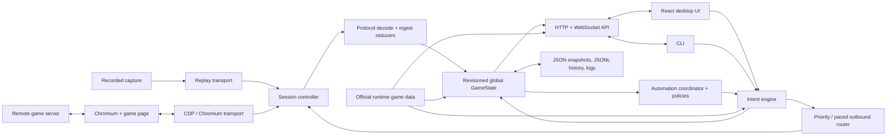

# Current product and architecture

## Executive finding

CitadelOps is already more than a browser helper. It is a local control system around a live, remotely authoritative game:

- it starts an app-owned browser session;
- observes and decodes bidirectional WebSocket traffic;
- materializes an account and castle model;
- accepts interactive, scheduled, and automated requests;
- validates and serializes game commands;
- correlates responses before declaring outcomes;
- serves a React desktop UI, HTTP/WebSocket API, and CLI;
- persists settings, state, history, captures, and diagnostics;
- refreshes official game data at runtime;
- supports recorded-traffic replay.

The central architectural challenge is therefore not conventional CRUD. It is maintaining a safe, ordered control loop over an external system whose protocol and catalog evolve independently.

The current 2.0 work has discovered several correct primitives—transport adapters, reducers, revisions, resource claims, intent receipts, response barriers, and a shared path for manual and automated operations. The rewrite should retain those semantics. The main opportunity is to move domain ownership out of global technical layers and into cohesive capability modules.

## Scope and evidence

This review used the active `codex/version-2.0.0` working tree on 2026-07-15. The tree contains substantial uncommitted development, so this document describes the code actually present rather than only the last commit. It also reviewed the repository’s existing `Architecture.md`, which is treated as design intent rather than evidence that every boundary has been achieved.

The reviewed surface includes the application composition root, session transports, protocol ingest, state store and models, intent engine and definitions, outbound router, automation coordinator and policies, API and event stream, React contracts and context, CLI, persistence, telemetry, and official-data updater.

## Present topology



The process is composed in `Server/App/Application.go`. The default executable in `main.go` binds a local web server, selects a Chromium or replay transport, creates the application, serves the UI/API, and can automatically start the game session. The React and Go parts ship as one application, while `cmd/CitadelOpsCLI/Main.go` exercises the same API from a separate command-line client.

## Current functional surface

The following is an architectural inventory, not a promise that every edge case is complete.

| Product capability | Present behavior and evidence |
|---|---|
| Session and browser lifecycle | Browser discovery/selection, app-owned profiles, Chromium start/stop, headless mode, connection status, reconnection, and replay transport under `Server/Session`. |
| Protocol observation | Bidirectional frame capture, opcode decoding, reducer dispatch, unknown-message observation, response correlation, and raw telemetry under `Server/Protocol`, `Server/Ingest`, and `Server/Telemetry`. |
| Account/castle state | Player and session identity, castles and focus, commanders, generals, castellans, movements, stationing, inventory, markets, alliance/map data, event state, presets, reports, and automation status in `Server/State`. |
| Buildings and construction | Catalogs, castle layout, expand/construct/place/move/upgrade/finish/store/demolish operations, target reconciliation, and construction-item state and actions. |
| Equipment and crafting | Equipment inventory and loadouts, equip/unequip/gems/swap/reconfigure/upgrade/sell, optimizer support, crafting state, and Sceat/resource automation. |
| Troops and logistics | Movement, kingdom transfer, station/recall, recruitment, tools, hospital behavior, food balancing, and related capacity checks. |
| Combat and presets | Attack and defense presets, spying, battle history/statistics, target tracking, and player/alliance intelligence. |
| Event automation | Towers, invasion, nomads, Khan, Storm, Rift, Berimond/Beri, bird and station behavior, plus schedulable policies. |
| Official data | Version discovery, bounded downloads, digest/cache handling, offline fallback, localized collections, and domain catalog projections under `Server/GameData`. |
| User surfaces | React views for castles, events, presets, automation, equipment, movement, statistics, alliance targets, Rift, settings, patch notes, and support; CLI/API equivalents for many control and diagnostic operations. |
| Operations and diagnostics | Intent receipts, cancellation, operation inspection, health, update state, telemetry, history, reports, raw protocol observations, and replay. |

The named intent catalog is broad. It covers lifecycle/configuration/data refresh; construction and layout; shop and construction items; troop movement; equipment; castle focus and defense; alliance and map queries; crafting and logistics; spy and event actions; decoration presets; reports; and Hall of Legends skills. This breadth matters: a viable architecture cannot optimize only for passive parsing or only for automation.

## Implemented, intended, and incomplete

The 2.0 architecture document correctly calls for runtime official data, a canonical revisioned model, one named-intent mutation plane, transport independence, replay, explicit API DTOs, a thin composition root, bounded/redacted telemetry, persistence migrations, CLI/detached API access, and future tool/LLM adapters.

The active tree has implemented the first half well:

- runtime official data and offline cache;
- live/replay session transport port;
- ordered reducer commits and stale-generation fencing;
- canonical state and operation receipts;
- one intent plane for UI, CLI, scheduling, reports, and server automation;
- claims, attack admission, pacing, cancellation, and committed-response barriers;
- unknown-protocol observation and useful diagnostics.

Several completion conditions remain materially unfinished:

- The API returns internal state structures rather than independently versioned public DTOs.
- `Server/App` is a composition root and also contains roughly 12,000 lines of feature planners, payloads, guards, and actions.
- The client still carries a very large built static game-data directory instead of relying only on runtime projections.
- Raw telemetry is neither comprehensively redacted nor bounded by a product retention policy.
- State and configuration reject unfamiliar schema versions rather than using registered migrations.
- A secure detached API, dedicated LLM/tool adapter, and general query service are not implemented.
- The UI is a local SPA displayed in the controlled browser, not a native desktop shell.

The reachable UI also differs from the total code surface:

- fourteen top-level screens are selected through local React state; there is no URL router, deep linking, or browser-history navigation;
- a standalone currency view, castle resource card, spy-report archive, and Beri settings component exist but are not mounted;
- building catalog/preview/expansion API methods have no general UI consumer;
- operation receipts are retained without a general operation-center view;
- one equipment-cleanup automation runs from a browser `setInterval`, so it is not truly headless;
- player-history series/backfill behavior is incomplete compared with the UI’s stated possibilities;
- several settings flows use fire-and-forget updates rather than the revision-aware path.

These are not all automatic rewrite requirements. The parity manifest in [DecisionAndMigration.md](DecisionAndMigration.md) separates reachable current behavior from dormant code, legacy behavior, and future intent so the rewrite does not accidentally promote or delete a partial feature.

As a scale snapshot rather than a benchmark, the reviewed tree contains about 50,000 lines of non-test Go server code and 33,700 lines of TypeScript/TSX. The persisted state observed during review was about 1.4 MB, current logs were about 103 MB, and `Client/dist/game-data` was about 267 MB. Those numbers explain why whole-state copying, full-state client refresh, unbounded retention, and duplicated catalog delivery now matter.

## Representative runtime workflows

### 1. Observation and state reduction

1. The Chromium transport observes a WebSocket message through the browser debugging protocol, or the replay transport emits a recorded message.
2. The session controller attaches connection/session context and forwards it to the ingest pipeline.
3. Protocol decoding identifies direction and opcode while preserving unrecognized traffic for diagnostics.
4. A registered reducer interprets the message and mutates the state in one serialized transaction.
5. The store increments a global revision and publishes changed domain labels.
6. The API event stream notifies clients. The React API context then debounces and fetches the entire state object again.

Important semantics hidden inside this flow include per-connection order, focused-castle application, identifier namespaces, optional fields, snapshots that supersede earlier observations, and session-generation boundaries.

### 2. Interactive operation

1. A React view or the CLI submits a named request with arguments, actor, priority, optional expected revision, and optional dry-run behavior.
2. The intent engine finds a planner, reads the current snapshot and catalogs, validates preconditions, calculates resource claims, and creates an execution plan.
3. Admission control prevents conflicting work. A stale revision can cause rejection or replanning.
4. Structured command steps are encoded and queued on separately paced command/attack lanes.
5. The session transport injects the command into the live game page.
6. Correlated wire and committed-state barriers wait for the relevant response to pass through reduction.
7. The operation receipt advances through planned, queued, running, paused, succeeded, cancelled, or failed states.
8. The resulting state change reaches the UI through the same event/refetch path.

The distinction between “command sent” and “effect observed and committed” is essential. A greenfield implementation that returns success after a socket write would not have behavioral parity.

### 3. Automated operation

1. A committed state change, configuration change, or timer wakes the automation coordinator.
2. A capability policy evaluates state and settings and returns no decision, a named request, a follow-up, or a future schedule.
3. The coordinator submits the request through the same intent engine used by interactive callers.
4. Claims, admission rules, priorities, pacing, correlation, receipts, and state reduction remain shared.

This unified action path is one of the present architecture’s strongest decisions. The replacement should not create a privileged automation back door that bypasses safety checks.

### 4. Startup, recovery, and replay

At startup, CitadelOps loads configuration, official-data cache, a normalized state snapshot, history, and runtime services. State persistence is debounced; history uses append-oriented files; traffic telemetry is rotated into channel/session logs. Replay feeds recorded traffic through the same decode/reduce path as a live transport, allowing protocol work without sending commands to the game.

Replay is valuable but not yet equivalent to a canonical, versioned event history. Raw traffic captures can include sensitive payloads, and state reconstruction is affected by decoder versions, missing observations before capture start, nondeterministic time, and official-data version.

## What is architecturally strong today

### One operation path

UI, CLI, scheduling, and automation converge on named intents. This creates one place for validation, conflicts, priorities, dry runs, cancellation, receipts, and response completion.

### Explicit protocol and transport seams

The session transport interface already admits Chromium and replay implementations. Protocol decoding and registered reducers avoid placing every opcode in a single switch inside the browser layer.

### Safety-oriented execution semantics

Global revisions, resource claims, admission, lane pacing, session generation, correlation, and committed-response barriers address real races in a live control system. Some representations can change, but the semantics should be written into the parity contract.

### Runtime official-data handling

Catalog data is versioned and refreshed from official sources with limits and offline fallback. This is preferable to compiling a fragile copy of game data into business logic.

### Diagnostics and offline development

Raw observation records, history, receipts, telemetry, and replay create the beginnings of an excellent protocol-forensics and support platform.

## Architectural pressure points

### 1. A global state aggregate has become the integration mechanism

`GameState` contains nearly every product concern: identity, all castles, commanders, movements, schedules, inventory, markets, alliance, map, multiple event families, presets, automation, reports, and protocol observations. Store mutation deep-clones the aggregate, increments one revision, and publishes domain labels.

Consequences:

- unrelated capabilities contend on one revision and one lock;
- every new feature expands a shared type and its clone/normalization logic;
- a high-frequency observation pays work proportional to global state size;
- ownership is unclear because many packages read or mutate the same aggregate;
- eventual multi-account support would multiply the aggregate rather than clarify it.

The replacement needs account-scoped ordering but not a single account-wide data structure.

### 2. Domain behavior is split by technical layer

A feature commonly requires a state field, ingest reducer, intent registration/planner, automation policy, configuration section, API projection, TypeScript contract, and React component in separate top-level packages. This is organized for runtime machinery, not for changing one product capability.

The result resembles a distributed monolith inside one process: boundaries exist, but a domain change still crosses most of them. Capability slices should contain the feature-specific pieces while depending on a small execution kernel.

### 3. Internal state is also the public contract

The state endpoint returns the internal `GameState`. The React client maintains a corresponding large TypeScript contract and one broad context. A `state.changed` event carries revision/domain metadata; the client then fetches the entire state again.

Consequences include manual Go/TypeScript drift, broad rerenders, bandwidth and serialization growth, no per-view compatibility boundary, and difficulty supporting a remote/mobile client. Public query DTOs should instead be owned and versioned by capabilities, with snapshots/deltas and generated clients.

### 4. The generic intent model risks becoming an internal language

The engine supports actions, resolvers, raw opcode/payload steps, waits, timeouts, barriers, retry/resume policies, dependencies, claims, and admission. This power encodes useful safety semantics, but domain plans spread across large application files and generic JSON-heavy step structures.

The next design should keep a small typed operation lifecycle while letting each capability implement ordinary Go planning and result interpretation. A generic workflow DSL should exist only if users genuinely author workflows that require it.

### 5. Persistence is useful but fragmented

Settings, normalized state, history, operation state, and telemetry use different JSON/JSONL/log paths and durability rules. They cannot be updated transactionally, schema migration is spread across loaders, and querying history requires purpose-built scans. Raw capture files remain appropriate for large traffic, but small mutable records and indexes would benefit from one transactional store.

The current state checkpoint waits for a two-second quiet period and restarts that timer on each state event. Sustained protocol traffic can therefore defer a checkpoint until shutdown. History and official-data versions have no comprehensive pruning policy, and the telemetry persistence queue can grow without a hard bound if disk writes fall behind.

### 6. Security mode is implicit

The default bind address is loopback, and the WebSocket path performs a localhost-oriented origin check. The HTTP surface itself does not establish an authenticated caller identity, while the executable can be configured to bind more broadly. Loopback lowers exposure but is not proof that a request came from the CitadelOps UI.

Remote/headless evolution would magnify this gap. Local and remote operation should be explicit modes with separate policy: a per-launch local credential plus strict host/origin checks for local use; TLS, durable identity, authorization, rate limits, and audit for remote use.

### 7. Telemetry can retain sensitive traffic

The telemetry store intentionally preserves complete original WebSocket payloads, including long and login-related traffic. Persisted telemetry is currently created with permissions broader than the state/config files, and its persistence queue is not hard-bounded. That is powerful for reverse engineering and replay, but it requires restrictive permissions, visible retention controls, redaction or encryption choices, bounded storage, and safe export. Operational logs should correlate message identifiers without duplicating secrets.

### 8. UI composition mirrors backend aggregation

Large views and a global API context make individual screens hard to reason about and optimize. The issue is not React itself; it is the absence of feature-level query contracts, local state ownership, and task-oriented workflows. Backend capability slices should have matching frontend feature modules without forcing identical internal models.

## Behavior-preservation contract

“Same functionality” should mean observable semantic parity, not identical package names or serialized private structs. The following invariants are the rewrite’s acceptance boundary.

### Protocol and model invariants

- Preserve the exact outbound opcode, field name, identifier namespace, omission/null behavior, and value encoding for every supported command.
- Preserve inbound merge/replace rules, focused-castle routing, session boundaries, and authoritative snapshot precedence.
- Preserve domain distinctions that share numeric values. In particular, construction-item `CID` is not a building/decoration identifier; `RS` is remaining seconds; and the outgoing `gbc.CID` identifies a castle instance rather than a construction item.
- Preserve runtime official-data lookup, level resolution, localization, digest/version behavior, size limits, cache fallback, and per-instance overrides.

### Execution invariants

- Preserve command and attack lane ordering, priority, pacing, deadlines, and queue-overflow behavior.
- Preserve admission conflicts and resource claims so incompatible operations cannot interleave.
- Preserve expected-revision validation or an equivalent per-capability version check.
- Preserve correlation across session generations and prevent an old response from completing a new operation.
- Preserve the rule that required responses are reduced into state before success is reported.
- Preserve cancellation, timeout, pause/resume, dry-run, schedule, and receipt semantics exposed to callers.
- Preserve the same safety path for user, CLI, scheduler, and automation actors.

### Product and data invariants

- Preserve existing configuration defaults and migrations, offline operation, `CITADEL_DATA_DIR` precedence, and automatic discovery/import of existing data. A platform-default directory change is allowed only as an explicit, reversible migration rather than silent relocation.
- Preserve supported views, settings, automation policies, named operations, diagnostics, histories, and replay workflows.
- Preserve browser selection/profile/lifecycle and update behavior.
- Preserve public API v2 behavior until a separately versioned client migration is complete.
- Preserve user data through a tested, reversible migration with backup and integrity checks.

## Requirements implied by the current product

| Requirement | Architectural implication |
|---|---|
| Remotely authoritative state | Local events are observations; reconnect and refresh must reconcile with authoritative snapshots. |
| Ordered live traffic | Each account/session needs one sequencing authority even if storage and queries are partitioned. |
| Protocol evolution | Unknown input must be retained safely; decoder changes must be replayable and capability-local. |
| Automated mutation | Planning needs fresh state, conflicts, pacing, cancellation, and an explainable outcome trail. |
| Desktop simplicity | The default should remain one installable application with offline-capable local data. |
| Multiple user surfaces | UI, CLI, replay, and headless/API callers need stable contracts around the same core. |
| Sensitive captures | Diagnostics need minimization, redaction/encryption, retention, and export controls. |
| Future account growth | Stable profile identity and its authoritative game-account binding must be first-class partition keys now, even if one account is supported initially. |

## Repository evidence index

The following single reference block records the principal code ranges used for the findings above. Line numbers describe the 2026-07-15 working tree and may move as the active rewrite continues.

```text
startLine: 7
endLine: 381
filePath: /Users/nebulabot/Desktop/CitadelOpsDesktop/Architecture.md
purpose: existing 2.0 intent, package boundaries, and completion conditions

startLine: 20
endLine: 99
filePath: /Users/nebulabot/Desktop/CitadelOpsDesktop/main.go
purpose: process composition, bind address, transport selection, and server lifecycle

startLine: 33
endLine: 203
filePath: /Users/nebulabot/Desktop/CitadelOpsDesktop/Server/App/Application.go
purpose: service graph, registrations, automation policies, and background lifecycle

startLine: 13
endLine: 50
filePath: /Users/nebulabot/Desktop/CitadelOpsDesktop/Server/Session/Transport.go
purpose: live/replay transport port

startLine: 263
endLine: 427
filePath: /Users/nebulabot/Desktop/CitadelOpsDesktop/Server/Session/Controller.go
purpose: bounded frame queue, ordered commit, and connection-generation fencing

startLine: 101
endLine: 250
filePath: /Users/nebulabot/Desktop/CitadelOpsDesktop/Server/Ingest/Pipeline.go
purpose: decode, observe, reduce, commit, correlate, and telemetry order

startLine: 9
endLine: 30
filePath: /Users/nebulabot/Desktop/CitadelOpsDesktop/Server/State/Models.go
purpose: distinct wire identifier types

startLine: 904
endLine: 942
filePath: /Users/nebulabot/Desktop/CitadelOpsDesktop/Server/State/Models.go
purpose: global GameState aggregate

startLine: 11
endLine: 240
filePath: /Users/nebulabot/Desktop/CitadelOpsDesktop/Server/State/Store.go
purpose: global revisions, snapshots, full deep clones, and event publication

startLine: 23
endLine: 111
filePath: /Users/nebulabot/Desktop/CitadelOpsDesktop/Server/Intent/Types.go
purpose: requests, plans, claims, steps, admission, and lifecycle types

startLine: 179
endLine: 830
filePath: /Users/nebulabot/Desktop/CitadelOpsDesktop/Server/Intent/Engine.go
purpose: planning, revalidation, claims, execution, generation fencing, and response barriers

startLine: 173
endLine: 357
filePath: /Users/nebulabot/Desktop/CitadelOpsDesktop/Server/Outbound/Router.go
purpose: priority/deadline ordering and outbound lane pacing

startLine: 13
endLine: 39
filePath: /Users/nebulabot/Desktop/CitadelOpsDesktop/Server/Automation/Types.go
purpose: automation policy decision model

startLine: 102
endLine: 360
filePath: /Users/nebulabot/Desktop/CitadelOpsDesktop/Server/Automation/Coordinator.go
purpose: state/config triggers, gating, scheduling, and intent submission

startLine: 58
endLine: 445
filePath: /Users/nebulabot/Desktop/CitadelOpsDesktop/Server/API/Server.go
purpose: routes, internal-state response, event invalidation, and origin check

startLine: 19
endLine: 288
filePath: /Users/nebulabot/Desktop/CitadelOpsDesktop/Server/GameData/Updater.go
purpose: official endpoints, limits, cache, and offline fallback

startLine: 131
endLine: 397
filePath: /Users/nebulabot/Desktop/CitadelOpsDesktop/Server/Telemetry/Store.go
purpose: complete payload retention, persistence queue, and file permissions

startLine: 10
endLine: 52
filePath: /Users/nebulabot/Desktop/CitadelOpsDesktop/Server/Paths/Paths.go
purpose: instance data-directory behavior

startLine: 26
endLine: 248
filePath: /Users/nebulabot/Desktop/CitadelOpsDesktop/cmd/CitadelOpsCLI/Main.go
purpose: CLI over the shared API and intent surface

startLine: 32
endLine: 282
filePath: /Users/nebulabot/Desktop/CitadelOpsDesktop/Client/src/api/ApiContext.tsx
purpose: global client context, full-state refresh, polling, and shallow validation

startLine: 1126
endLine: 1161
filePath: /Users/nebulabot/Desktop/CitadelOpsDesktop/Client/src/api/Contracts.ts
purpose: hand-maintained global state transport contract

startLine: 40
endLine: 213
filePath: /Users/nebulabot/Desktop/CitadelOpsDesktop/Client/src/App.tsx
purpose: local-state navigation and centrally owned feature modals

startLine: 4
endLine: 42
filePath: /Users/nebulabot/Desktop/CitadelOpsDesktop/Client/src/config/Navigation.tsx
purpose: fourteen user-visible top-level views

startLine: 43
endLine: 231
filePath: /Users/nebulabot/Desktop/CitadelOpsDesktop/Client/src/api/CitadelClient.ts
purpose: event/REST client, building endpoints, generic intent submission, and cancellation

startLine: 10
endLine: 81
filePath: /Users/nebulabot/Desktop/CitadelOpsDesktop/Client/src/settings/AutoEquipmentCleanup.ts
purpose: client-timer-owned equipment cleanup policy

startLine: 22
endLine: 30
filePath: /Users/nebulabot/Desktop/CitadelOpsDesktop/Client/src/settings/Configuration.ts
purpose: fire-and-forget configuration update path

startLine: 12
endLine: 42
filePath: /Users/nebulabot/Desktop/CitadelOpsDesktop/Server/API/History.go
purpose: incomplete precomputed player-history series/backfill response
```

## Conclusion

The present architecture is directionally sound at the control-loop level and overly broad at the ownership level. A successful greenfield design should preserve the flow

```text
observe -> reduce -> decide -> execute -> observe outcome -> receipt
```

while changing who owns each piece. The stable center should be a small account execution kernel; construction, equipment, movement, events, alliance, and other areas should be independently understandable capabilities around it.
