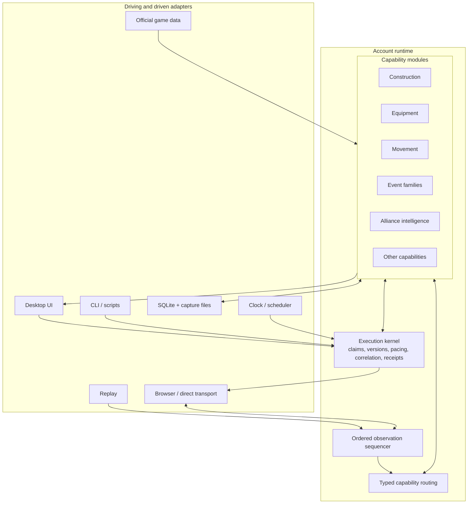

# Target abstraction: the account capability runtime

## Thesis

The durable abstraction for CitadelOps is an **account capability runtime**: an ordered runtime for one game account that hosts cohesive product capabilities and mediates every external effect.

This is narrower than the entire application and broader than a parser. It is the unit that must answer:

- What has CitadelOps observed for this account and session?
- What does a particular capability currently know?
- Is a requested action safe and valid now?
- Which exact command should be sent, in what order and at what pace?
- What later observation proves success, failure, or ambiguity?
- Why did a user or automation request that action?

The abstraction separates stable control semantics from frequently changing game-domain knowledge.

## Vocabulary

| Term | Meaning |
|---|---|
| Observation | An inbound or outbound transport message, timer, configuration update, catalog update, or lifecycle signal seen by CitadelOps. It is evidence, not automatically a state change. |
| Fact | A typed, normalized domain interpretation of an observation, such as a castle snapshot, movement update, or construction slot update. |
| Capability | A cohesive product area that owns its facts, state, queries, requests, planning, outcome interpretation, automation policy, and UI contract. |
| Request | A typed desire to inspect or change the game, submitted by a user, CLI, scheduler, automation, or future tool. |
| Plan | The capability’s decision about prerequisites, claims, commands, waits, and expected outcomes using a specific state/catalog version. |
| Effect | A mediated interaction with the browser/game, clock, filesystem, notification system, or another explicit port. |
| Outcome | Succeeded, failed, cancelled, timed out, or indeterminate, justified by correlated observations and state commits. |
| Receipt | The durable, user-visible lifecycle and explanation for one request. |
| Projection | A purpose-built read model for a UI screen, API caller, policy, report, or diagnostic tool. |

Identity exists in stages. A stable local `ProfileID` identifies a configured browser/profile before login; `SessionID` and `ConnectionID` identify live attempts; an observed `GameAccountID` becomes available only after an authoritative login baseline. An account runtime may therefore begin unbound, but it cannot execute game mutations until it has fenced the session generation and bound the profile/session to the observed account.

If a profile logs into a different game account, the runtime must stop effects, close or fence the old account binding, and open the other account partition only after explicit reconciliation. It must never merge two accounts’ state, captures, settings, or histories merely because they used the same browser profile.

These distinctions prevent three dangerous equivalences:

- a frame is not necessarily a domain change;
- a socket write is not a successful game action;
- an internal state structure is not an API contract.

## Logical architecture



The diagram does not imply a generic in-process message broker. Direct typed Go calls are preferable inside the modular-monolith option. “Routing” means ownership and dispatch, not mandatory asynchronous messaging.

## Capability ownership

A capability owns the decisions that change together. A construction capability, for example, should own:

- construction-related wire decoders and normalized facts;
- castle construction/layout state and its migrations;
- construction-item identifier types and catalog projection;
- query DTOs for layout, queues, targets, and available actions;
- typed requests such as construct, upgrade, move, store, demolish, equip TCI, and buy TCI;
- planners, validation, resource claims, command serialization, and outcome matching;
- automatic construction and AutoTCI policy;
- feature configuration schema and defaults;
- frontend feature module and generated API client surface;
- fixtures and parity cases.

It should not own browser startup, global command pacing, authentication, generic receipt persistence, wall-clock implementation, or raw database connections. Those arrive through narrow ports.

This arrangement makes construction-item namespace rules local and reviewable rather than an informal constraint shared across parser, automation, state, and UI packages.

## The execution kernel

The kernel is intentionally small and domain-agnostic. It owns mechanisms that must be consistent across capabilities:

### Account and session ordering

Each bound account runtime has one sequencing authority. Before account identity is known, the local profile/session sequencer assigns positions under `ProfileID`; binding records the corresponding `GameAccountID` and continues with an account-scoped causal position. It rejects or marks late input and rotates generation identifiers on reconnect. Capability reducers may run independently only when doing so cannot reorder dependent facts.

A simple initial implementation can use one goroutine per account runtime. This avoids data races without requiring every mutation to clone a global structure. Expensive parsing or report work can run outside the loop and return a version-checked result.

### Versioning

Use two levels of version:

- an account observation position for causal diagnostics and replay;
- a monotonically increasing version per capability projection or aggregate.

A request declares which capability versions informed its plan. Revalidation checks only the dependencies that matter. This retains stale-plan protection while avoiding conflicts caused by an unrelated protocol observation.

The API v2 compatibility adapter additionally maintains a monotonic **legacy commit revision** using the existing advancement rules, including protocol-only commits that currently increment `GameState.Revision`. Each exposed legacy revision is associated with the capability-version vector current at that point. A v2 `/state` response and `state.changed` event use this legacy revision; a v2 `expectedRevision` must equal the current legacy revision exactly before the adapter translates the request to the corresponding current capability dependencies. This deliberately preserves v2’s broad stale-request behavior while API v3/native capability callers benefit from narrower version checks.

### Claims and admission

Claims are typed resources with account scope, for example:

```text
castle/{CastleID}/construction-slot/{Slot}
castle/{CastleID}/layout
commander/{CommanderID}/equipment
movement/attack-lane
shop/construction-item
```

The kernel arbitrates exclusive/shared claims, priorities, queue limits, deadlines, and cancellation. Capabilities declare claims; they do not implement their own lock managers.

### Outbound pacing and lanes

The kernel owns bounded queues, lane policy, minimum intervals, priority, deadlines, backpressure, and connection reset behavior. A full queue must produce an explicit rejected or failed receipt; silently discarding a state-changing command is not acceptable.

### Correlation and completion barriers

Every effect attempt gets an operation ID, session generation, send sequence, correlation strategy, and timeout. A plan may require:

- the matching wire response;
- the matching response to be committed by one or more capability reducers;
- a later authoritative snapshot satisfying a predicate;
- or an explicit best-effort/no-response outcome.

Only the kernel can advance a receipt, but the capability supplies typed match and success rules. An old session’s response can never complete a new session’s operation.

### Receipt lifecycle

Keep a small, stable lifecycle such as:

```text
accepted -> planned -> queued -> executing -> awaiting-observation
         -> succeeded | failed | cancelled | timed-out | indeterminate
```

“Paused” or “retry scheduled” can be explicit states where existing behavior requires them. Every transition records actor, reason, causal operation/observation, relevant capability versions, and a safe user-facing summary.

The receipt is the common explanation surface for a click, automation decision, scheduled action, CLI request, or future LLM tool call.

## Capability contract

The exact Go interfaces should emerge from a thin walking skeleton, but each capability needs these logical contracts:

```text
Describe() -> name, schema versions, owned opcodes, queries, requests
Decode(Observation) -> zero or more typed Facts
Reduce(CurrentState, Fact) -> NewState, ChangedProjections
Query(QueryName, Parameters) -> versioned DTO
Plan(TypedRequest, Snapshot, Catalog, Clock) -> TypedPlan or rejection
Interpret(EffectResult, Observations, NewState) -> Outcome
Evaluate(Trigger, Snapshot, Settings) -> zero or more explained Requests
Migrate(StoredVersion, Data) -> CurrentVersion
```

This is a conceptual contract, not a recommendation for one enormous Go interface. Small interfaces should be defined by consumers. A passive reporting capability may have no effects; an infrastructure capability may have no UI query.

Capabilities may collaborate only through explicit published facts, read ports, or request ports. They should not import another capability’s storage model. Cross-cutting workflows belong in an orchestration capability that declares its dependencies and claims.

## State model

### Partition by account and capability

Replace one `GameState` with an account directory and independently versioned capability stores:

```text
AccountRuntime[GameAccountID]
  IdentityState[ProfileID -> GameAccountID]
  CastleDirectory
  ConstructionState[CastleID]
  EquipmentState[GameAccountID]
  MovementState[GameAccountID]
  AllianceState[AllianceID]
  EventState[EventKind]
  ...
```

This is not permission to duplicate core identities. Use opaque typed identifiers and small shared identity records. Capability state can reference `GameAccountID`, `CastleID`, `CommanderID`, and similar IDs without depending on a giant shared model.

### Authoritative, derived, and ephemeral data

Every stored field should be classified:

- **Observed authoritative:** last value directly reported by the game, including source position and observed time.
- **Derived:** reproducible projection calculated from authoritative observations and a catalog version.
- **Local desired:** a user setting, target, preset, schedule, or automation preference.
- **Operational:** claims, queued requests, correlation, retries, and receipts.
- **Ephemeral UI:** filters, selected rows, open panels, and optimistic affordances.

Mixing these categories makes reconciliation and migration ambiguous. In particular, local desired state should not be overwritten merely because a game snapshot lacks it.

### Unknown and partial knowledge

Absence in an intercepted protocol message often means “not observed,” not “empty.” Capability models should represent unknown, partial, stale, and authoritative values explicitly. Queries can then show freshness and automation can require a refresh before acting.

## Requests and effects

### Typed requests, not arbitrary JSON internally

HTTP or IPC may encode JSON/protobuf, but the application boundary should convert immediately to a typed capability request. Types should distinguish domain namespaces even when the wire uses integers, for example `ConstructionItemID`, `BuildingWodID`, and `CastleInstanceID`.

The operation registry can still expose stable names for API compatibility, but planners should be ordinary capability code rather than arrays of generic raw steps.

### Effects remain mediated

A capability may ask for effects such as:

- send a structured game command on a named lane;
- request/refresh a game snapshot;
- schedule a future wake-up;
- publish a user notification;
- persist a local desired-state change;
- read a versioned official-data catalog.

It should not obtain a raw WebSocket or browser object. This guarantees that interactive and automated work continues through the same pacing, claims, correlation, and audit path.

### Idempotency and ambiguity

Not every game command is naturally idempotent. The kernel should distinguish:

- safe retry before a confirmed send;
- retry requiring a fresh authoritative read;
- non-retryable action after an ambiguous disconnect;
- compensating or user-review workflow.

An `indeterminate` outcome is more truthful than declaring failure and automatically duplicating a purchase or attack.

## Query and API contracts

### Purpose-built projections

Expose queries shaped for tasks, not a serialized internal world. Examples:

- `GetCastleConstructionOverview`
- `GetEquipmentLoadoutEditor`
- `ListMovements`
- `GetAutomationStatus`
- `GetEventDashboard`

A query response includes its schema version, account/castle scope, capability version, freshness, and relevant operation links. Large collections use pagination or cursors.

### Snapshot plus delta

For each subscribed query:

1. the client obtains a versioned snapshot;
2. the event stream sends typed deltas or invalidation for that projection;
3. the client applies a valid next delta or refetches only that projection after a gap.

This eliminates full-world refetch on every observation while making reconnect recovery explicit.

### Generated boundaries

Describe HTTP contracts with OpenAPI and, if it earns its keep, event contracts with AsyncAPI or an equivalent schema. Generate TypeScript transport types and clients. Keep hand-written UI view models local to each frontend feature.

Version public contracts independently of internal state migrations. During parity migration, keep an API v2 compatibility adapter that composes legacy-shaped responses from new capability queries.

## Persistence

### Transactional application store

A local relational database is a strong default for:

- account and capability projection snapshots;
- capability schema versions and migration cursors;
- settings and desired state;
- schedules;
- request/receipt transitions;
- bounded observation/fact journal metadata;
- history indexes and report metadata.

SQLite fits the default single-machine deployment. Use one application-owned writer, short transactions, explicit checkpoint policy, backups, integrity checks, and a release containing the current upstream WAL fixes. Do not let future workers independently mutate the same database.

### Capture store

Large raw frames belong in bounded compressed capture segments, optionally encrypted, with metadata and hashes in the database. Retention is user-visible and defaults should minimize sensitive data. Export should support a redacted support bundle.

### Selective journal

Journal the records that justify behavior:

- observation envelope or secure payload reference;
- decoder version and parse status;
- normalized fact identifiers where replay value warrants it;
- request, plan summary, claims, effect attempt, and outcome;
- projection checkpoint/cursor.

Do not event-source secrets, official catalog blobs, arbitrary UI preferences, or every cached derived field. The remote game remains authoritative; the journal is the source of truth only for what CitadelOps observed, decided, and attempted.

## Configuration, catalogs, time, and secrets

- Each capability owns a versioned settings schema, defaults, validation, and migration. A configuration service provides atomic updates and a composed settings UI.
- Official game data is an immutable versioned catalog snapshot. An operation records the catalog version used for planning. Refresh swaps the snapshot atomically; it does not mutate domain models behind a planner’s back.
- Every policy and planner receives a `Clock`. Replay uses a deterministic clock and scheduler.
- Credentials, tokens, encryption keys, and browser secrets go through a `SecretStore` backed by platform facilities where possible. They never appear in ordinary settings export or diagnostic context.

## Frontend alignment

Backend and frontend should align by capability without sharing private representations:

```text
Client/src/Features/Construction/
  Api/
  Components/
  Hooks/
  Models/
  Routes/
  State/
```

Each route loads only its query projections and operation receipts. Cross-feature navigation uses stable IDs and links. A small shell owns session/account selection, global notifications, command palette, accessibility, and layout.

Task-oriented flows should replace pages that expose raw backend breadth. For example, “reach building target” can show current state, missing prerequisites, proposed operations, conflicts, and progress in one workflow while still exposing advanced details.

### Usability contract

The architecture should make five product behaviors cheap and consistent:

1. **Know what is live.** Every projection shows account/castle scope, freshness, disconnected/last-known state, and the observation or refresh needed before acting.
2. **Preview consequential work.** Plans expose prerequisites, resource use, commander/slot claims, expected commands, and irreversible steps in domain language before approval where appropriate.
3. **Follow progress in one place.** Requests from a click, schedule, or automation appear in the same operation center with status, reason, causal observations, cancellation, and safe recovery actions.
4. **Explain automation.** A policy reports why it acted, why it did nothing, what setting/state it used, and when it will evaluate again. Users should not need raw logs for normal understanding.
5. **Recover without guessing.** Stale state, parser degradation, disconnects, configuration conflicts, and indeterminate effects produce specific refresh/retry/review actions rather than generic failure banners.

Navigation should use stable URLs/deep links for accounts, castles, capability views, presets, targets, reports, and operation receipts. Advanced protocol and intent tools remain available behind an explicit expert capability, separated from ordinary workflows.

## Proposed code ownership shape

The exact names are illustrative and honor the repository’s PascalCase source-file rule:

```text
cmd/
  CitadelOpsDesktop/
  CitadelOpsCLI/
  CitadelOpsReplay/

internal/
  Runtime/                 account loop and lifecycle
  Execution/               claims, lanes, receipts, correlation
  Contracts/               generated public schemas and compatibility
  Platform/                Chromium, HTTP, SQLite, files, clocks, secrets
  Capabilities/
    Construction/
      Domain/
      Protocol/
      Application/
      Projection/
      Automation/
    Equipment/
    Movement/
    Alliance/
    Events/
    ...

Client/src/
  App/
  Features/
  Generated/
  Shared/
```

Enforce boundaries with `internal`, import checks, and tests that fail on forbidden capability-to-capability dependencies. The application composition root wires ports; feature packages do not discover globals.

## Abstractions to avoid

- **One universal event bus as the application.** It hides dependencies and makes order/transactions implicit. Use typed direct calls inside one process; publish events only where decoupling is real.
- **One generic repository for every model.** Capabilities need different consistency and query behavior. Give them narrow stores or unit-of-work ports.
- **One workflow DSL for all commands.** Ordinary typed Go code is easier to refactor and debug. A user-authored workflow feature can be added separately.
- **One public `GameState`.** Public consumers need stable, task-shaped projections.
- **Microservices by feature.** This desktop product does not gain enough from network boundaries between construction, equipment, and movement.
- **Native Go shared-library plugins.** They are not portable or isolated enough for the likely desktop targets.
- **Strict event sourcing of the remote game.** Captures are incomplete observations; the remote game, not a local log, owns canonical state.

## Why the abstraction survives all three options

The modular monolith hosts multiple account runtimes in one process. The journal-first option changes how observations and projections are persisted but retains the same capability and kernel contracts. The supervised-worker option moves an account runtime behind versioned IPC without changing its conceptual ownership.

That makes topology a reversible deployment decision rather than the definition of the domain model—the central reason to choose this abstraction.
