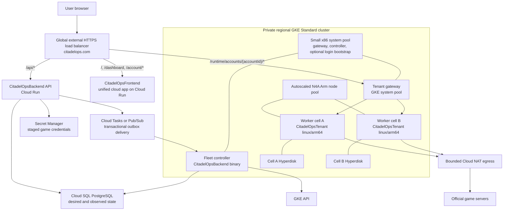

# CitadelOps Hosted Platform Architecture

Status: proposed implementation architecture, 2026-08-14

This document extends [TenantArchitecture.md](TenantArchitecture.md). That
document defines the account boundary inside one CitadelOps process. This
document defines how `CitadelOpsBackend`, `CitadelOpsFrontend`, and a fleet of
those bounded processes form the hosted product.

## Decision

Use the existing repositories as three explicit product layers:

| Repository | Hosted responsibility |
| --- | --- |
| `CitadelOpsFrontend` | Public landing site and the one cloud application shell: passkey sign-up/login, command center, account switcher, and a top-level Account Center for hosted accounts, lifecycle, billing, profile, and security |
| `CitadelOpsBackend` | User and entitlement source of truth, hosted-account desired state, provisioning state machine, placement scheduler, audit trail, access grants, fleet reconciler, and tenant gateway |
| `CitadelOpsDesktop` | Linux/Arm worker image, bounded multi-account supervisor, one private account runtime per game account, direct game connections, state, automation, and command-center API |

Run the long-lived game workers on a private GKE Standard cluster with an
autoscaled N4A node pool. Do not run them on Cloud Run: these sessions are
stateful, continuously connected, disk-backed, and expected to live beyond an
HTTP request. Do not begin with a directly autoscaled stateful managed instance
group either. Compute Engine does not support autoscaling a MIG after stateful
configuration is added, which would force CitadelOps to rebuild pod placement,
service discovery, volume scheduling, and safe scale-in itself.

`CitadelOpsBackend` remains the orchestration authority, but its public request
handlers do not receive broad GKE permissions. A separate least-privilege
`fleet-controller` binary from the same repository reconciles backend desired
state into Kubernetes resources.

## Product identities

The platform must not overload the existing hardware-license model.

| Identity | Meaning |
| --- | --- |
| CitadelOps user | A person authenticated by `CitadelOpsBackend` using a passkey |
| Hosted account | One game account owned by one CitadelOps user; identified by an opaque UUID, never by the game username |
| Account runtime | The private `App.Application`, session, state, configuration, operations, reports, and API for one hosted account |
| Worker cell | One bounded `CitadelOpsTenant` process containing several account runtimes and one shared cell data volume |
| N4A node | A GKE worker VM that can run one or more worker-cell pods according to their measured CPU and memory requests |

A CitadelOps user can own several hosted accounts. A worker cell can host
accounts from several users because the 2.3 supervisor enforces the logical
boundary. The cell is still a shared process and failure domain, so public copy
must say **isolated account runtime**, not **dedicated worker**. A dedicated
single-account cell can be offered later where process isolation is required.

## Deployment topology



Start in `us-east1` so the control plane remains near the current services.
The N4A worker node pool must currently be limited to `us-east1-b` and
`us-east1-c`; `us-east1-d` does not currently list N4A. Keep the regional GKE
control plane and the small system pool independent of that worker constraint.

Use an N4A-compatible GKE version and Hyperdisk storage. N4A is Arm64, does not
use SMT, and supports Hyperdisk rather than Persistent Disk. Build and publish
multi-architecture images for shared services and a verified `linux/arm64`
worker image for CitadelOpsTenant.

## Unified site, routing, and authentication

Account management is a top-level view inside the unified cloud application,
not a dashboard settings corner or a second portal that launches private tenant
sites. The preferred public layout is:

- `citadelops.com`: the one canonical origin for the public landing pages,
  passkey auth, stable `/dashboard`, Account Center, API, and runtime gateway;
- `www.citadelops.com`: redirect to the canonical origin; and
- `citadelops.app`: compatibility redirect during migration, not the permanent
  cross-origin API design.

One origin removes the current CORS and cross-site-cookie failure mode. Configure
WebAuthn for the exact final origin and issue one secure, HTTP-only, host-only
application session. A user signs in once, reaches `/dashboard`, and switches
game accounts from the application header. A separate top-level `/account`
view manages the user's complete CitadelOps account, hosted-account fleet,
billing, profile, and security without another login or site.

Selecting an account uses this flow without another user-visible authentication
step:

1. The unified app loads the authenticated user's hosted accounts from the
   backend and selects one in its account context.
2. The command center keeps the browser route at `/dashboard` and connects its
   HTTP/WebSocket client to the internal runtime prefix
   `/runtime/accounts/{id}/...`.
3. The tenant gateway validates the same application session, verifies that
   `hosted_accounts.user_id` owns the requested account, and resolves its current
   worker-cell placement.
4. The gateway removes all caller-supplied identity headers and adds a new
   short-lived internal assertion for that exact account.
5. The worker verifies the assertion and account ID again before selecting the
   account runtime.
6. Switching accounts closes the old event stream, clears the account-local
   React store, obtains a new snapshot, and only then renders the new account.

The opaque account UUID remains explicit inside API and WebSocket requests; that
is safer than a process-global "currently selected account" cookie and permits
two tabs to view different accounts. It is an implementation locator, not a
private dashboard link or credential. Cross-account or cross-user requests
return not found. Browser clients never receive a worker token, worker address,
Secret Manager reference, game password, or internal cell ID.

The external Application Load Balancer supports WebSockets. The React client
must still reconnect and request a snapshot after a revision gap. The cloud
product should build one app shell rather than iframe one React app inside
another. During migration, two bundles can share the origin only if the command
center gets a distinct asset prefix such as `/command-center-assets/`; both
current frontends otherwise emit root-absolute `/assets/` URLs.

## CitadelOpsBackend control plane

Keep three separately deployed binaries in the backend repository:

1. `api`: current authentication/licensing service plus hosted-account APIs.
2. `fleet-controller`: an asynchronous, idempotent reconciler with narrowly
   scoped Kubernetes, Secret Manager, and task-consumer permissions.
3. `tenant-gateway`: a stateless WebSocket/HTTP reverse proxy and placement
   cache. It has no game credentials and no Kubernetes mutation permission.

An optional fourth `bootstrap-controller` can own short-lived browser login
jobs. It must not be part of the public API process.

### Control-plane records

Add new migrations rather than extending `local_license_verified`:

| Record | Required purpose |
| --- | --- |
| `hosted_accounts` | Owner, display name, declared/verified game world, desired state, observed state, status detail, billing state, configuration revision, timestamps |
| `runtime_cells` | Region, Kubernetes resource name, image digest, desired/observed lifecycle, hard account limit, resource class, storage reference, last heartbeat |
| `account_placements` | Unique account-to-cell assignment, fencing epoch, desired/observed revision, lease and readiness timestamps |
| `provisioning_jobs` | Durable state machine, attempt count, next retry, terminal error code, and user idempotency key |
| `hosted_events` | Append-only, user-safe status events for the cloud app and a separate operator audit payload |
| `player_identities` | Canonical game identity keyed by world and player ID; shared by public World Intelligence and private hosted-account projections |
| `hosted_player_metrics_current` | One tenant/account-authorized merged My Stats and Feature Stats row per active player binding |
| `hosted_player_metric_samples` | Append-only private sample history, idempotent by runtime sample ID and fenced by placement epoch |
| `credit_holds` or `hosted_entitlements` | Idempotent reservation/capture/release; hosted billing stays separate from desktop device credits |
| `control_outbox` | Events written in the same database transaction as desired state, then delivered at least once |

Every external create, retry, suspend, resume, credential rotation, and delete
operation is idempotent. Cloud Tasks and Pub/Sub can deliver more than once, so
job handlers must compare desired revision, placement epoch, and terminal state
before causing side effects.

### Public hosted API

Use nouns that match the product rather than calling game accounts instances:

```text
GET    /api/hosted/accounts
POST   /api/hosted/accounts
GET    /api/hosted/accounts/{id}
DELETE /api/hosted/accounts/{id}
POST   /api/hosted/accounts/{id}/credentials
POST   /api/hosted/accounts/{id}/actions/reconnect
POST   /api/hosted/accounts/{id}/actions/restart
POST   /api/hosted/accounts/{id}/actions/suspend
POST   /api/hosted/accounts/{id}/actions/resume
GET    /api/hosted/events
```

`POST /api/hosted/accounts` accepts the display name, game server/world, plan,
and an idempotency key. Credential submission is a separate no-store request so
ordinary provisioning retries never replay or log a password. The list API
returns account state and opaque IDs, never a worker or dashboard URL.

`GET /api/hosted/events` is a server-sent event stream for lifecycle changes.
Polling remains a bounded fallback, not the normal dashboard update loop.

During migration, desktop-local My Stats history and report analytics remain a
safety fallback. The runtime publisher must not delete them until the backend
ingest path and tenant-authorized reads have been implemented, verified, and
made authoritative.

### Internal reconciliation contract

The backend is the source of desired state; workers report observed state.
Neither side overwrites the other.

Each worker cell receives:

- `cellId`, desired revision, image/config revision, and resource class;
- account IDs assigned to that cell;
- a unique monotonically increasing placement epoch for each account;
- a unique short-lived private-metrics grant for each exact runtime placement,
  never shared with dashboard or control-plane credentials;
- secret references and start/suspend intent, never raw credentials in a
  manifest or environment variable.

Each heartbeat reports:

- cell image digest, uptime, CPU, RSS, disk usage, and allocatable slots;
- per-account process/session status and its placement epoch;
- connected, logged-in, socket-ready, game-data-ready, player identity,
  `generation`, and `baselineGeneration`;
- recent reconnect reason and bounded error code, without raw game traffic or
  credential material.

Account runtimes are long-lived: a cell keeps a runtime — and its game
session — for as long as the account stays in the cell's desired set, that is,
for as long as the user keeps the hosted account enabled. A placement lease
that lapses without renewal pauses only the credential-bearing side channels
(private-metrics publishing waits for a fresh grant; dashboard grants expire on
their own schedule) and is reported as `placementLease: "lapsed"`; it never
logs the account out or drains the runtime, so a control-plane outage or a
missed reconcile cannot interrupt hosted accounts.

Fencing is therefore an explicit control-plane step rather than a worker-side
timeout: before placing a game account on another cell, reconcile it out of the
old cell (or send `startSession: false`) and confirm the response. A newer
placement epoch still fails stale reconciles closed, and the first reconcile
after an unreachable cell reconnects drains anything it no longer owns; until
then the game's single-session rule and login cooldown bound any overlap.

Private player metrics are pushed from the bound runtime to an internal backend
ingest endpoint; runtimes never connect to Cloud SQL. The backend validates the
grant, cell, tenant, runtime, desired revision, lease, epoch, game account UID,
world, and player ID before an idempotent write. It stores the full private
sample under the hosted account, then passes only explicitly allowlisted public
fields through the World Intelligence provenance resolver. Public World
Intelligence collection and subscriber broadcasts do not depend on any hosted
runtime being online.

## Game server directory: one shared map from world code to endpoint and zone

A hosted account's server selection is a world code (`US1`, `GB1`, `INT1`),
but the game connection needs two derived values the code alone cannot give:

- the WebSocket host — many worlds share one **multi-zone host**
  (`ep-live-mz-int1-sk1-gb1-game.goodgamestudios.com` serves INT1, SK1, and
  GB1), so deriving `ep-live-<code>-game` from the code is wrong for roughly
  half the directory;
- the SmartFox **zone** the login frame must name (`EmpireEx_19` for GB1,
  bare `EmpireEx` for INT1) — the wrong zone is rejected even on the right
  host.

The authority is the game's own network config
(`https://empire-html5.goodgamestudios.com/config/network/1.xml`). It flows
through the platform as data, not code:

1. **CitadelOpsBackend** keeps the directory in the `game_servers` /
   `game_server_directory` tables (package `gameservers`), refreshed on a
   daily schedule (`GAME_SERVER_DIRECTORY_URL` overrides the source; worlds
   that leave the directory are kept but retired). It is served read-only at
   `GET /api/game-servers` (portal pickers) and `GET /api/game-servers/{code}`.
   Hosted account creation and credential updates only accept listed, active
   worlds.
2. **The hosted login install** (`PUT /orchestrator/v1/runtimes/{id}/login`)
   carries the resolved `serverUrl` and `zone` beside the code. The runtime
   validates both against the official host and zone shapes and prefers them
   over its own catalog — a world GGE opens tomorrow connects with only a
   backend directory refresh, no desktop release.
3. **CitadelOpsDesktop** embeds a snapshot of the directory
   (`Server/Session/GameServers.go`) so the standalone desktop resolves codes
   offline; `Session.RefreshGameServerCatalog` can re-read the official
   document at runtime, and `GET /api/v2/session/game-servers` feeds the
   Settings form's world suggestions. Saved logins persist the code, the
   resolved URL, and — when installed by the control plane — the pinned zone.

## Dashboard hosting: frontend renders, backend remembers, runtime is live

The dashboard is not served by the runtime. CitadelOpsFrontend serves the
Command Center UI persistently and chooses its data source per account:

- **Live**: when the account has a runtime, the frontend talks to that shard
  through the tenant gateway (`/accounts/{id}/api/v2/...`, `state.snapshot`
  and deltas over the events socket, intents as async operations). Cells accept
  same-host requests by default; a frontend served from its own origin is
  allowlisted with `--tenant-dashboard-origins https://app.citadelops.app`
  (`CITADEL_TENANT_DASHBOARD_ORIGINS`), which answers CORS preflights and adds
  credentialed CORS headers for exactly those origins on the shard router and
  the tenant login. Every other origin is still refused.
- **Stale**: when no runtime exists (disabled, released, draining, or being
  re-placed) the frontend renders the backend's latest **dashboard
  checkpoint** for the account. Each runtime publishes checkpoints under its
  private-metrics grant to `--tenant-dashboard-checkpoint-url`
  (`CITADEL_DASHBOARD_CHECKPOINT_URL`): every five minutes while the state
  revision changes, promptly after a game-session transition (connected,
  cooldown, released, error, stopped), and once more as its final act before it
  is drained. A checkpoint is the exact document the dashboard renders live —
  the `state.snapshot` client projection (about 700 KB for the heaviest known
  profile, ~80 KB gzipped), the `config.changed` configuration snapshot, the
  last hundred operation receipts, the sanitized session situation
  (`released`/`cooldown`/`suspended`, `retryAt`, `loginFailure`), and the
  bound game identity. The backend keeps the latest checkpoint per hosted
  account (fenced by placement epoch, idempotent by checkpoint ID) and serves
  it to the frontend with its `observedAt`, so the UI can label the view as
  "as of 12:31 — released until 12:36" and offer Reconnect. Metrics samples
  (My Stats and Feature Stats history) and cloud battle reports remain
  backend-resident as before, so tables the user should always be able to
  view never depend on a runtime.
- **World Intelligence** is read by the frontend directly from the backend's
  public `/api/world-intel/v1` endpoints; it never needed the runtime. The
  runtime's `/api/v2/world-intel/*` routes are only a read-only convenience for
  the desktop, and `worldId` comes from the account record or the checkpoint's
  `account.worldId` when no runtime is present.

The runtime never serves the frontend bundle for hosted accounts; the cell's
optional static frontend remains a local/canary convenience.

## Worker-cell image

`Dockerfile.hosted` in the desktop repository builds the cell image: a static
linux binary compiled **without** the `desktop` build tag (no embedded client
bundle — hosted mode never mounts the desktop frontend handler; the portal is
the dashboard), running as a non-root user with `CITADEL_DATA_DIR=/data` on a
volume that holds every runtime profile. The entrypoint is `--hosted`; cell
identity, capacity, ingest URLs, and dashboard origins are flags, while the
orchestrator token and dashboard cookie key arrive via environment
(`CITADEL_TENANT_ORCHESTRATOR_TOKEN`, `CITADEL_TENANT_SESSION_KEY`). The
header of the Dockerfile documents a complete `docker run` example that pairs
with the backend's `HOSTED_CELLS_JSON`.

## Worker-cell lifecycle

The worker now has safe in-process `AddAccount` and `RemoveAccount` operations
plus a private reconciler with desired revisions, per-account placement epochs,
credential leases that pause side channels without draining long-lived
runtimes, sanitized SSE status, and runtime-scoped dashboard grants. The
startup-only tenant manifest remains appropriate for local/canary use. The
backend scheduler, placement persistence, secret-reference delivery, and live
fleet deployment are still separate unfinished control-plane work.

One cell is represented by a one-replica StatefulSet (or an equivalent
one-replica controller resource), a private ClusterIP Service, a Kubernetes
service account, and one cell Hyperdisk volume. The cell disk contains
`Data/Accounts/{account-id}` for only the accounts assigned to that cell.

Placement rules are:

1. Never exceed the cell's evidence-backed hard account limit.
2. Prefer the same verified game world so allowed shared-world facts remain
   useful and never mix worlds accidentally.
3. Preserve CPU, memory, disk, and reconnect headroom; a free logical slot is
   not capacity if the cell is already saturated.
4. Keep heavy accounts movable to a smaller or dedicated cell without changing
   their public account ID or URL.
5. Do not automatically move an account merely to make packing prettier.
   Relocation is a fenced, checkpointed maintenance operation.

Start the production canary with a cell hard limit of four accounts. The code's
current default of eight is a guardrail, not validated N4A density. Increase the
limit only after replay and live canaries prove action latency, reconnect rate,
heap, GC, disk, and p95/p99 CPU behavior.

For production recovery, prefer Hyperdisk Balanced High Availability for cell
data. A less expensive zonal Hyperdisk with snapshots is acceptable for an
explicit pilot RTO, but the product must not describe it as zone-resilient.

## Provisioning state machine

Use explicit durable states instead of a synthetic progress timer:

```text
requested
  -> credential_staged
  -> capacity_pending
  -> placed
  -> bootstrapping
  -> synchronizing
  -> ready

Any active state -> requires_user_action | degraded | suspended
Any nonterminal state -> deleting -> deleted
```

The normal create flow is:

1. The API authenticates the CitadelOps user, validates the requested world/plan,
   creates the hosted account, reserves the credit/entitlement, and writes an
   outbox event in one transaction.
2. In the CitadelOpsFrontend Account Center the user enters the game server
   selection (server code such as `US1`) and the game username and password
   for that hosted account. The browser posts them only over TLS in a
   no-store request body to the credential endpoint, never as URL parameters,
   local storage, or analytics. The backend seals the credential with a KMS
   key (envelope encryption) into a per-account Secret Manager secret and keeps
   it for as long as the hosted account exists: it is used every time the user
   enables the runtime and again whenever the account must be placed on a new
   runtime. No credential value or recoverable derivative enters PostgreSQL,
   logs, tracing, browser storage, task payloads, or dashboard URLs; PostgreSQL
   holds only the secret reference, server selection, and rotation timestamp.
3. The scheduler chooses a healthy compatible cell. If none has safe capacity,
   it creates a new `runtime_cells` desired record.
4. The fleet controller creates the cell's Kubernetes identity, Service,
   StatefulSet, and Hyperdisk claim.
5. The pending cell pod requests fixed CPU/memory. GKE cluster autoscaling adds
   an N4A node when existing nodes cannot place it.
6. The cell registers and receives its assignment revision; the reconcile adds
   the account runtime to the supervisor with `startSession` as desired.
7. The fleet controller unseals the credential and delivers it to that exact
   runtime placement with
   `PUT /orchestrator/v1/runtimes/{id}/login` — a separate no-store request
   over the private control channel carrying the placement epoch, username,
   password, server code, and language. The cell writes the runtime's own
   protected saved-login file (`Data/Accounts/{id}/Session/BackgroundLogin.json`,
   mode 0600), derives the websocket endpoint from the server code, never
   echoes or logs the values, and (re)starts the desired session so the new
   credential is used at once. Status reports only
   `backgroundLogin: {configured, server, language, updatedAt}`.
   `DELETE /orchestrator/v1/runtimes/{id}/login` scrubs the saved login from
   the cell — also for an already-drained runtime — before relocation or
   account deletion.
8. The backend publishes `ready` only after conjunctive readiness passes and
   the observed player identity belongs to the requested hosted account.
9. The unified dashboard enables that account in its switcher. No private URL
   or second login is created during this transition.

### Login outcomes and re-placement

Every runtime reports its login obstacle in cell status:
`sessionState`, `cooldownUntil`, `retryAt`, and
`loginFailure: {code, class, fatal, observedAt, suspendedUntil?}` where `code`
is the raw game `lli` response code. The classes follow the official HTML5
client's `BasicErrorConstants` and the cases its `LLICommand` handles:

| `lli` code | Official constant | Payload | Class | Client wording |
| --- | --- | --- | --- | --- |
| 0 | `ALL_OK` | — | (success) | — |
| 20 | `INVALID_PASSWORD` | — | `invalid_credentials` | — |
| 21 | `PLAYER_NOT_FOUND` | — | `wrong_server` | "Player not found." |
| 26 | `NO_AVATAR_CREATED` | — | `wrong_server` | account has no character on this world |
| 27 | `IS_BANNED` | `RS` remaining seconds; `GDPR: true` = deactivated | `suspended` (`account_deleted` with GDPR) | "Your account has been suspended! Suspended until: {0}" / "permanently suspended" / "Your account has been deactivated!" |
| 368 | `EXISTING_MAPPING_WRONG_SERVER` | instance id | `wrong_server` | account is mapped to another server |
| 369 | `UNEXPECTED_FACEBOOK_ERROR` | — | `unknown` | — |
| 409 | `INVALID_LOGIN_TOKEN` | — | `invalid_credentials` | client deletes its saved login |
| 423 | `INVALID_GLOBALSERVER_LOGIN_TOKEN` | — | `invalid_credentials` | — |
| 453 | `LOGIN_COOLDOWN_ACTIVE` | `CD` remaining seconds | `cooldown` | "Too many login attempts. Try again in:" |
| `vck` ≠ 0 | version check | — | `client_version_rejected` | runtime refreshes the official build itself |
| other | — | — | `unknown` | — |

The runtime keeps the session connected on its own: transient drops and
`client_version_rejected` reconnect after the user's relog delay; `cooldown`
waits out the game's cooldown plus the relog delay; a temporary `suspended`
(remaining time known) reports state `suspended` with `retryAt` and resumes
automatically when the suspension ends; `unknown` codes retry with the relog
delay doubling per repeat, capped at one hour, so a single unknown code is not
yet a reason to re-place. `invalid_credentials`, `wrong_server`,
`account_deleted`, and a permanent `suspended` park the session in `error`
(no `retryAt`) until the saved login or server selection changes — installing
a changed credential through `PUT …/login` restarts it immediately, while
reconciles that merely repeat `startSession: true` do not spend the rejected
login again. A live-session kick ("You have been barred from the server",
`generic_alert_user_kicked`) is a socket close, not an `lli` code, and follows
the ordinary reconnect path.

#### Release policy: runtimes live only while connected

Hosted assignments run under `onDisconnect: "release"` (the default when the
field is omitted; `hold` must be requested explicitly). The runtime then keeps
only a short immediate retry window for plain drops and
reports every longer wait as session state `released` with `retryAt`
(`cooldownUntil` for a 453, `suspendedUntil` for a temporary suspension, the
relog delay otherwise, and no `retryAt` when only a changed login can help),
after which its loop stops. The backend persists the wait separately from any
runtime — `{account, reason class, code, retryAt}` on the hosted account — and
reconciles the runtime out so its slot serves another account. When `retryAt`
passes, when the user presses **Reconnect** in the Account Center, or when a
rotated credential arrives, the scheduler places a fresh runtime (same or
another cell), installs the stored credential, and starts the session.
Resources are therefore consumed on demand: a 5-minute cooldown costs
5 minutes of no runtime and a 24-hour suspension costs nothing until it ends.

The Account Center **Reconnect** button calls
`POST /api/hosted/accounts/{id}/actions/reconnect`: if the account currently
has a runtime the backend forwards it as `POST /orchestrator/v1/runtimes/{id}/reconnect`
(the runtime retries at once even inside a cooldown or suspension and reports
the outcome), otherwise it creates the runtime immediately instead of waiting
for `retryAt`. The Command Center shows the same button on the runtime's own
dashboard (`session.reconnect` intent) whenever the session is reconnecting,
cooling down, suspended, or released.

The backend decides from that signal, using the stored credential:

| Observed | Decision |
| --- | --- |
| `cooldown` | Wait until `retryAt`; never re-place, a second runtime would only extend the lockout. |
| `suspended` | `requires_user_action`; never retry or re-place while `suspendedUntil` is in the future (or with no end time). This is the code observed on the James account. |
| `account_deleted` | Terminal: stop the account, notify the user. |
| `invalid_credentials` | `requires_user_action`; wait for a rotated credential from the Account Center. |
| `wrong_server` | `requires_user_action`; the user must correct the server selection or username in the Account Center. |
| repeated `unknown` codes across the runtime's own retries, bootstrap that never reaches `ready`, repeated reconnect churn, or an unhealthy cell | Re-place: reconcile the account out of the current runtime, revoke its saved login there, add it to a fresh runtime (same or another cell), and install the stored credential again. |

## Autoscaling model

There are two separate control loops:

1. **CitadelOps capacity loop:** the backend scheduler adds a worker cell when
   desired accounts cannot fit healthy existing cells. It drains and deletes a
   cell only after it is empty, its disk is checkpointed, and its retention rule
   permits deletion.
2. **GKE infrastructure loop:** fixed pod requests make an unplaceable cell pod
   pending; GKE adds an N4A node. When nodes become empty after safe cell moves
   or deletions, GKE can remove them.

Do not autoscale occupied workers down from low CPU. Game connections can be
quiet while still required, and a random scale-in would destroy availability.
CPU and memory protect placement; desired-account slot pressure drives scale
out. Maintain one warm cell slot initially and decide whether a whole warm node
is worth its shared cost after measuring real provisioning time.

The first N4A pool should use on-demand nodes. Spot VMs are not suitable for
primary game sessions until forced reconnect and disk reattachment behavior is
proven. Evaluate commitments only after the 24-hour canary establishes stable
density.

The earlier capacity samples are planning inputs only: one busy worker averaged
about half of one Apple M4 core, peaked above one core, and used roughly
0.75-0.80 GiB RSS. The preliminary N4A estimate of roughly 1.5-1.75 accounts per
vCPU is not a production packing guarantee. Start with N4A standard memory and
test N4A high-CPU only after heap/RSS evidence shows that 2 GiB per vCPU is safe.

## CitadelOpsFrontend product surface

Use the existing future hosted worktree as a visual prototype, but reshape it
into the single cloud app shell and bind it to the real backend contract. The
authenticated product must not present a portal card that opens a separately
authenticated tenant site.

Public routes:

- `/`: product explanation and hosted/desktop choices;
- `/pricing`: explicit per-hosted-account plan and what shared infrastructure
  means;
- `/security`: credential, account-isolation, retention, and recovery model;
- `/download` and `/patch-notes`;
- `/login` and `/signup` using the existing passkey flow.

Authenticated routes and surfaces:

- `/dashboard`: stable command-center route for the account selected in the
  header switcher;
- the account switcher: name, readiness, and fast account change without a new
  login or page origin, plus a **Manage hosted accounts** action;
- `/account`: a first-class Account Center, with Hosted Accounts, Billing,
  Profile, and Security tabs;
- Account Center > Hosted Accounts: create and manage any number of hosted game
  accounts allowed by the user's entitlement, with lifecycle state, credential
  rotation, reconnect/restart/suspend/delete, and audit history;
- Account Center > Billing: user-wide credits, charges, renewals, invoices, and
  the per-hosted-account cost breakdown;
- Account Center > Profile and Security: display identity, passkeys, sessions,
  and account recovery; and
- a global overview when no account is selected or when every account needs
  action.

This keeps scope understandable:

- the dashboard and its existing settings are about the currently selected
  game account and its CitadelOps behavior;
- Account Center is about the CitadelOps user and the full hosted-account fleet.

The selected account is ordinary UI state, not authorization state. Persist a
last-used preference for convenience, but send the explicit opaque account ID
on every account API and WebSocket request. Never let a hidden global selection
decide which runtime a command mutates.

Reuse the existing command-center UI in the authenticated shell rather than
maintaining two visually similar dashboards. The target is one React ownership
tree and one auth context. An intermediate release may serve separately built
landing and command-center bundles behind the same origin, but navigation,
session, account switcher, and Account Center must still behave as one product
and must not use an iframe.

The create flow must add game server/world selection. Username and password
fields are never persisted in React state beyond the modal lifetime, preview
records, local/session storage, analytics, error reporting, or replay tooling.
Disable body capture and field recording for the credential endpoint.

Replace the prototype's timer-derived percentages with backend states and safe
milestones. `ready` specifically means:

- worker cell heartbeat is current;
- the account session is connected, logged in, and socket-ready;
- game data is ready;
- `generation == baselineGeneration`;
- the verified player identity matches the hosted account.

The dashboard should say why an account is not ready and distinguish user action,
capacity wait, bootstrap failure, game rejection, worker degradation, and
billing suspension.

## Security boundaries

- Worker nodes and cell Services have no public IP or public load balancer.
- Only the tenant gateway can reach cell HTTP/WebSocket ports; network policy
  denies lateral account access and direct system-pool access otherwise.
- Worker pods do not get Kubernetes API credentials unless their job requires
  them. The fleet controller uses a dedicated service account and narrow RBAC.
- Workload Identity replaces service-account key files. Grant secret access at
  the individual secret and cell identity, not project-wide.
- Access secrets programmatically rather than placing values in manifests,
  environment variables, Kubernetes Secrets, or logs.
- Account data volumes, snapshots, and backups are encrypted and have explicit
  retention. SQLite/WAL state is checkpointed before an application-consistent
  snapshot.
- Raw game traffic, passwords, account identifiers, resources, currencies,
  inventory, reports, and action history never enter shared observability or
  multi-tenant analytics.
- Cloud Armor, request-size limits, CSRF/origin checks, rate limits, and no-store
  headers protect public auth and credential endpoints.

All game sockets initially share bounded Cloud NAT egress. Before increasing
fleet density, test whether the game service rate-limits or rejects many
accounts behind one public IP. If it does, assign worker pools to a controlled
egress-IP pool and cap accounts per IP. Do not wait for login failures to become
a fleet-wide outage before defining this metric.

## Reliability and operations

Required operational invariants:

- one active placement epoch and one game session per hosted account;
- no scale-in of occupied cells;
- graceful account/session stop before pod termination;
- PodDisruptionBudget and rolling drains so upgrades do not stop every cell at
  once;
- dashboard WebSocket resync after gateway, pod, or node reconnect;
- restore drills for one account, one cell, and one unavailable zone;
- canary image promotion by digest, with automatic rollback on readiness or
  reconnect regression;
- operator actions are audited separately from user-visible status text.

Monitor per cell and account:

- requested versus ready accounts and provisioning duration by state;
- current/maximum slots and pending-cell count;
- CPU, RSS, heap, GC pause, file descriptors, disk usage, and SQLite latency;
- game reconnect count/reason, login failures, socket uptime, baseline lag, and
  command dispatch p95/p99;
- gateway active WebSockets, authorization failures, route-cache misses, and
  cross-account denial tests;
- N4A node utilization, unschedulable pods, node provisioning time, Hyperdisk
  attach time, and NAT port/IP pressure.

## Delivery sequence

### Phase 0: prove the worker artifact

- Add a real Linux/Arm runtime image. The current desktop Dockerfile builds
  Windows/macOS release binaries and its final Alpine stage attempts to start a
  Windows executable, so it is not a hosted worker image.
- Run the 2.3 supervisor, isolation tests, and a one-account Background canary on
  N4A for 24 hours.
- Resolve the bootstrap method and validate multiple accounts behind the
  proposed NAT egress.

### Phase 1: backend desired state

- Add migrations, repositories, idempotent hosted APIs, credit hold/capture,
  outbox, safe SSE events, and ownership tests in `CitadelOpsBackend`.
- Add one signed application session usable by both the API and tenant gateway,
  plus internal workload assertions and ownership tests.
- Keep all infrastructure mutations behind a fake reconciler in tests.

### Phase 2: worker control contract

- Implemented in the worker: authenticated status/SSE, assignment revisions,
  dynamic supervisor reconciliation, placement fencing epochs and leases,
  runtime-scoped dashboard grants, and graceful per-runtime drain.
- Remaining control-plane integration: backend cell registration/heartbeat
  persistence, workload assertions, secret-reference resolution, and scheduler
  reconciliation against the worker contract.
- Keep the static tenant manifest as a local/canary entrypoint.

### Phase 3: GCP fleet foundation

- Create Terraform under `CitadelOpsBackend/deploy/gcp` for the load balancer,
  private regional GKE cluster, system and N4A pools, Workload Identity,
  Hyperdisk classes, NAT, Secret Manager policy, monitoring, and least-privilege
  service accounts.
- Deploy the fleet controller and tenant gateway with no public worker exposure.
- Prove that creating a cell causes a pending pod, N4A node growth, successful
  registration, and safe empty-cell/node scale-down.

### Phase 4: unified frontend integration

- Promote the hosted visual work from the isolated
  `CitadelOpsFrontend-future-worktree` after rebasing it deliberately.
- Replace preview storage/timers and dashboard links with the hosted API, SSE
  stream, stable `/dashboard`, header account switcher, and top-level Account
  Center.
- Add world selection, real failure/action states, responsive account controls,
  security copy, account-switch state reset tests, and cross-user tests.

### Phase 5: end-to-end pilot

- Provision at least two cells and enough accounts to force an N4A scale-out.
- Kill a worker pod and then a node; verify fenced reconnection and state
  recovery.
- Verify every account through uptime, connection history, game-data readiness,
  identity, synchronized generation/baseline, scans/actions, uploads, and error
  causes.
- Confirm no credential value or private game payload appears in PostgreSQL,
  browser storage, task payloads, logs, traces, error reporting, or exports.

## Launch gates

The hosted product is not ready merely because a worker endpoint returns 200.
Before paid launch, all of the following must pass:

1. Reproducible `linux/arm64` image and N4A compatibility.
2. Proven bootstrap without credential leakage.
3. 24-hour one-cell and multi-cell capacity results with p95/p99 headroom.
4. Automatic scale-out from a real create request and safe empty-only scale-in.
5. Cross-user HTTP and WebSocket isolation tests.
6. Fenced recovery from pod/node loss with no duplicate game session.
7. Hyperdisk snapshot and restore drill.
8. NAT/IP density validation against real login and reconnect behavior.
9. Real frontend state from backend receipts, not simulated progress.
10. Current GCP topology, quotas, N4A availability, and pricing verified under
    the production project.

The local GCP CLI configuration could not currently verify the deployed
CitadelOps topology because its interactive credential has expired. No cluster,
node pool, load balancer, service, quota, or production project state should be
treated as created or current from this document alone.

## Current external constraints

- [N4A machine series](https://cloud.google.com/compute/docs/general-purpose-machines#n4a_series)
  is Arm64, one physical core per vCPU without SMT, and Hyperdisk-only.
- [Arm workloads on GKE](https://cloud.google.com/kubernetes-engine/docs/concepts/arm-on-gke)
  documents N4A support and its GKE version/feature constraints.
- [GKE cluster autoscaling](https://cloud.google.com/kubernetes-engine/docs/how-to/cluster-autoscaler)
  adds nodes when pod requests cannot be scheduled and removes empty capacity.
- [Hyperdisk for GKE](https://cloud.google.com/kubernetes-engine/docs/concepts/hyperdisk)
  provides movable persistent volumes for supported nodes.
- [External Application Load Balancers](https://cloud.google.com/load-balancing/docs/https#websocket_support)
  support WebSocket proxying.
- [Stateful MIG limitations](https://cloud.google.com/compute/docs/instance-groups/configuring-stateful-migs#limitations)
  prohibit Compute Engine autoscaling after stateful configuration is applied.
- [Secret Manager best practices](https://cloud.google.com/secret-manager/docs/best-practices)
  recommend least privilege, Workload Identity, audit logging, and avoiding
  secrets in environment variables or files when programmatic access is
  possible.
