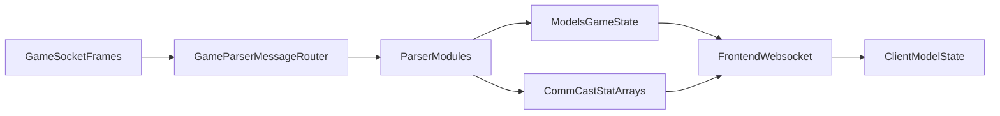

# Model Structure And Refinement Targets

## Current Server Model Topology

- `Server/Models/GameState.go` is the aggregate state root used across parser, function, and websocket layers.
- `Server/Models/PlayerCastleInfo.go` carries castle resources, production, storage, troops, and building rows.
- `Server/Models/CastleTroopsModel.go` contains troop dictionaries and overlapping troop DTO concepts.
- `Server/Models/CommStatModel.go` and `Server/Models/CastStatModel.go` hold wide stat aggregates and updater maps.
- `Server/Models/CommActualModel.go` and `Server/Models/CastActualModel.go` hold actual equipment-loadout snapshots.
- `Server/Models/DecorationCatalog.go` and `Server/Models/BuildingDefinitions.go` hold large static lookup payloads.

## Data Flow

## High-Value Consolidation Areas

1. Unify troop data ownership to avoid duplicated `CastleTroopData` vs `CastleTroops` semantics.
2. Collapse split stat ownership (`GameState` fields vs package-level stat arrays) into one canonical source.
3. Move static/generated maps into dedicated domains to reduce `Models` package gravity.
4. Normalize JSON tags and casing to keep wire contracts explicit and stable.
5. Separate wire DTOs from internal models at websocket boundaries.

## First Implemented Refinements

- Added explicit JSON tags for `AutoBirdDelayConfig` in `Server/Models/SettingsState.go`.
- Aligned `CastActualModel.PlaceHolder14` JSON tag casing with peer model fields in `Server/Models/CastActualModel.go`.
- Added `ptt` to the client `PlayerGlobalResources` shape in `Client/src/currency/context/ResourceContext.tsx`.

## Next Refactor Steps

1. Introduce canonical DTOs for outbound frontend payloads and migrate senders to use them.
2. Refactor troop model duplication with compatibility adapters during transition.
3. Consolidate commander/castellan stat array ownership and reset lifecycle behavior.
4. Mirror refined server DTOs to client type modules and separate UI view-model transforms.
